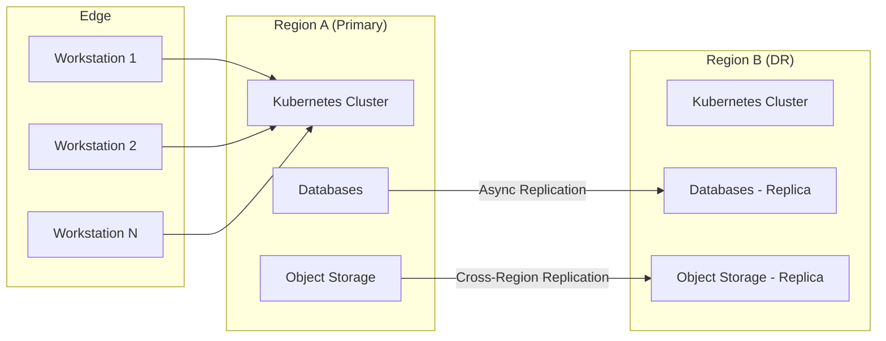

# Design Document: Enterprise AI Assistant Platform ("May")

## Overview

The Enterprise AI Assistant Platform ("May") is a multi-tenant, service-oriented system that observes, reasons about, and acts on a user's workstation environment. The platform is designed for regulated enterprise environments, combining rich AI capabilities (voice, vision, computer control, memory, workflows) with enterprise-grade security, privacy, observability, and governance.

### Design Goals

- **Multi-Tenant Isolation**: Cryptographic and logical separation between tenants at every layer
- **Defense in Depth**: No single point of trust; every service validates identity, authorization, and tenant context
- **Graceful Degradation**: The platform continues operating with reduced capability when dependencies fail
- **Privacy by Design**: Sensor data is ephemeral by default; PII is detected and redacted before crossing trust boundaries
- **Operational Maturity**: Full observability, documented SLOs, runbooks, and automated incident response
- **Cost Transparency**: Every billable operation is metered, attributed, and budget-constrained

### Key Design Decisions

| Decision | Rationale |
|----------|-----------|
| Single LLM_Gateway for all model calls | Centralizes cost control, prompt-injection defense, output filtering, and model routing |
| Edge_Agent as local proxy | Keeps sensor data local until consent is verified; enables Offline_Mode |
| Cryptographic audit chain | Tamper-evidence without requiring blockchain; verifiable by any party with the signing key |
| Confirmation_Challenge with server nonce | Prevents replay attacks on high-risk actions; binds confirmation to specific action |
| Memory layers with governance pipeline | All memory writes pass through redaction before persistence |
| Canary deployment for models/prompts | Contains blast radius of quality regressions in AI components |

## Architecture

### High-Level Architecture

```mermaid
graph TB
    subgraph "End_User Workstation"
        EA[Edge_Agent]
        HUD[HUD_Client]
        EA --> HUD
    end

    subgraph "API Gateway Layer"
        APIGW[API Gateway / Ingress]
    end

    subgraph "Core Services"
        IS[Identity_Service]
        LLM[LLM_Gateway]
        VS[Voice_Service]
        VIS[Vision_Service]
        CS[Control_Service]
        MS[Memory_Service]
        WS[Workflow_Service]
        CSS[Code_Sandbox_Service]
        ES[Emotion_Service]
        HS[Habit_Service]
    end

    subgraph "Cognitive Intelligence Services"
        CIS[Context_Intelligence_Service]
        COGS[Cognitive_State_Service]
        PS[Personality_Service]
        PIS[Proactive_Intelligence_Service]
    end

    subgraph "Advanced Memory & Knowledge Services"
        IGS[Intent_Graph_Service]
        KGS[Knowledge_Grounding_Service]
        POKG[POKG_Service]
    end

    subgraph "Planning & Reasoning Services"
        GES[Goal_Engine_Service]
        SIM[Simulation_Service]
        REF[Reflection_Service]
        PLS[Planning_Service]
    end

    subgraph "Extensibility & Self-Improvement Services"
        PLG[Plugin_Service]
        SIS[Self_Improvement_Service]
        FTS[Fine_Tuning_Service]
        RES[Research_Service]
    end

    subgraph "Infrastructure & Resource Services"
        RGS[Resource_Governor_Service]
        WDS[Watchdog_Service]
        CFS[Compute_Fabric_Service]
        EMS[Environment_Model_Service]
    end

    subgraph "Platform Services"
        AS[Audit_Service]
        TS[Telemetry_Service]
        SS[Secrets_Service]
        GS[Governance_Service]
        EVS[Eval_Service]
        COST[Cost_Service]
    end

    subgraph "External"
        IDP[Identity Provider]
        MODELS[Model Providers]
        KMS[Key Management Service]
        SIEM[SIEM Destination]
        WEB[Web Search APIs]
    end

    EA -->|mTLS| APIGW
    APIGW --> IS
    APIGW --> LLM
    APIGW --> VS
    APIGW --> VIS
    APIGW --> CS
    APIGW --> MS
    APIGW --> WS
    APIGW --> CSS
    APIGW --> ES
    APIGW --> HS

    %% Cognitive Intelligence connections
    CIS --> LLM
    CIS --> HS
    CIS --> POKG
    COGS --> PIS
    COGS --> PS
    PS --> LLM
    PIS --> HUD

    %% Advanced Memory & Knowledge connections
    IGS --> LLM
    IGS --> MS
    KGS --> LLM
    KGS --> WEB
    POKG --> CIS

    %% Planning & Reasoning connections
    GES --> IGS
    SIM --> CS
    SIM --> LLM
    REF --> SIS
    PLS --> WS
    WS --> SIM

    %% Extensibility connections
    PLG --> AS
    SIS --> EVS
    FTS --> CFS
    RES --> EVS
    RES --> SIS

    %% Infrastructure connections
    RGS --> EMS
    CFS --> RGS
    WDS --> AS
    EMS --> CIS
    EMS --> RGS

    IS --> IDP
    LLM --> MODELS
    SS --> KMS
    AS --> SIEM

    CS --> AS
    WS --> AS
    LLM --> AS
    MS --> GS
    LLM --> GS
    LLM --> COST
    CSS --> COST
```



### Communication Patterns

- **Edge_Agent ↔ Backend**: mTLS over gRPC/HTTP2 with JWT bearer tokens. The Edge_Agent negotiates API version on session start.
- **Service-to-Service**: mTLS or signed workload identities (SPIFFE/SPIRE). All inter-service traffic is encrypted.
- **Event Bus**: Authenticated message bus (e.g., NATS with JetStream or Kafka with mTLS) for async events (audit, telemetry, workflow triggers).
- **Request Context Propagation**: Every request carries a `RequestContext` containing tenant_id, principal_id, correlation_id, and trace context (W3C TraceContext).

### Deployment Topology



## Components and Interfaces

### Edge_Agent

**Responsibility**: Local sensor capture, consent enforcement, HUD rendering, offline capability, and secure proxy to backend.

**Key Interfaces**:
```
service EdgeAgent {
  rpc NegotiateSession(SessionRequest) returns (SessionResponse);
  rpc StreamAudio(stream AudioFrame) returns (stream TranscriptionEvent);
  rpc StreamScreenCapture(stream ScreenFrame) returns (stream VisionEvent);
  rpc ExecuteAction(ActionRequest) returns (ActionResponse);
  rpc GetConsentStatus(ConsentQuery) returns (ConsentStatus);
  rpc SetConsent(ConsentUpdate) returns (ConsentResponse);
  rpc PauseAll(PauseRequest) returns (PauseResponse);
  rpc KillSwitch(KillRequest) returns (KillResponse);
}
```

### Identity_Service

**Responsibility**: Authentication, token issuance, RBAC/ABAC evaluation, Confirmation_Challenge issuance and validation.

**Key Interfaces**:
```
service IdentityService {
  rpc Authenticate(AuthRequest) returns (TokenResponse);
  rpc RefreshToken(RefreshRequest) returns (TokenResponse);
  rpc ValidateToken(TokenValidationRequest) returns (ValidationResult);
  rpc Authorize(AuthzRequest) returns (AuthzDecision);
  rpc IssueConfirmationChallenge(ChallengeRequest) returns (Challenge);
  rpc ValidateConfirmationChallenge(ChallengeResponse) returns (ChallengeResult);
  rpc RevokeSession(RevocationRequest) returns (RevocationResult);
}
```

### LLM_Gateway

**Responsibility**: Sole broker for all model invocations. Handles dual-model architecture (local + cloud), provider abstraction, multi-factor routing (complexity, budget, privacy, latency, health), fallback, prompt-injection defense, output filtering, rate limiting, budget enforcement, circuit breaking, health monitoring, and canary deployment.

**Key Interfaces**:
```
service LLMGateway {
  rpc Invoke(InferenceRequest) returns (InferenceResponse);
  rpc StreamInvoke(InferenceRequest) returns (stream InferenceChunk);
  rpc GetModelRegistry(RegistryQuery) returns (ModelRegistryResponse);
  rpc UpdateCanaryConfig(CanaryConfig) returns (CanaryConfigResponse);
  rpc GetBudgetStatus(BudgetQuery) returns (BudgetStatus);
  rpc GetProviderHealth(ProviderHealthQuery) returns (ProviderHealthStatus);
  rpc RouteDecision(RoutingRequest) returns (RoutingDecision);
}
```

### Voice_Service

**Responsibility**: Speech-to-text and text-to-speech with language identification.

**Key Interfaces**:
```
service VoiceService {
  rpc TranscribeStream(stream AudioFrame) returns (stream TranscriptionResult);
  rpc Synthesize(SynthesisRequest) returns (stream AudioFrame);
  rpc IdentifyLanguage(AudioSample) returns (LanguageIdentification);
}
```

### Vision_Service

**Responsibility**: Screen and webcam analysis, OCR, workflow context classification, presence detection.

**Key Interfaces**:
```
service VisionService {
  rpc AnalyzeScreen(ScreenFrame) returns (ScreenAnalysis);
  rpc AnalyzePresence(WebcamFrame) returns (UserPresenceState);
  rpc ClassifyWorkflowContext(ScreenFrame) returns (WorkflowContext);
}
```

### Control_Service

**Responsibility**: Execute computer-control actions with risk-level enforcement, idempotency, audit, self-healing browser automation, OS abstraction, dry-run preview, and rollback tracking.

**Key Interfaces**:
```
service ControlService {
  rpc ExecuteAction(ActionRequest) returns (ActionResponse);
  rpc GetActionStatus(ActionStatusQuery) returns (ActionStatus);
  rpc CancelAction(CancelRequest) returns (CancelResponse);
  rpc DryRunPreview(ActionRequest) returns (DryRunResult);
  rpc GetRollbackDescriptor(RollbackQuery) returns (RollbackDescriptor);
  rpc ExecuteRollback(RollbackRequest) returns (RollbackResponse);
  rpc SelfHealSelector(SelectorHealRequest) returns (SelectorHealResponse);
}
```

### Memory_Service

**Responsibility**: Five-layer memory (Working, Episodic, Semantic, Procedural, Knowledge_Graph) with tenant/principal isolation and governance integration.

**Key Interfaces**:
```
service MemoryService {
  rpc Write(MemoryWriteRequest) returns (MemoryWriteResponse);
  rpc Query(MemoryQueryRequest) returns (MemoryQueryResponse);
  rpc Delete(MemoryDeleteRequest) returns (MemoryDeleteResponse);
  rpc ApplyRetention(RetentionRequest) returns (RetentionResponse);
}
```

### Workflow_Service

**Responsibility**: Durable multi-step workflow execution with persistence, retry, timeout, confirmation gates, simulation integration (pre-execution prediction), multi-agent team execution, 24-hour autonomous task management, and dependency cycle detection.

**Key Interfaces**:
```
service WorkflowService {
  rpc CreateWorkflow(WorkflowDefinition) returns (WorkflowHandle);
  rpc GetWorkflowStatus(WorkflowQuery) returns (WorkflowStatus);
  rpc PauseWorkflow(PauseRequest) returns (PauseResponse);
  rpc ResumeWorkflow(ResumeRequest) returns (ResumeResponse);
  rpc CancelWorkflow(CancelRequest) returns (CancelResponse);
  rpc ValidateDependencyGraph(WorkflowDefinition) returns (ValidationResult);
  rpc CreateAgentTeam(AgentTeamDefinition) returns (AgentTeamHandle);
  rpc GetPendingTasks(TaskQuery) returns (PendingTaskList);
}
```

### Code_Sandbox_Service

**Responsibility**: Isolated code execution with resource limits, network deny-by-default, sensitive-path protection, Git intelligence, IDE integration (VS Code), and code analysis capabilities.

**Key Interfaces**:
```
service CodeSandboxService {
  rpc Execute(ExecutionRequest) returns (ExecutionResult);
  rpc GetSupportedLanguages(Empty) returns (LanguageList);
  rpc GitStatus(GitStatusRequest) returns (GitStatusResponse);
  rpc GitDiff(GitDiffRequest) returns (GitDiffResponse);
  rpc GitLog(GitLogRequest) returns (GitLogResponse);
  rpc AnalyzeCode(CodeAnalysisRequest) returns (CodeAnalysisResult);
  rpc GetIDEContext(IDEContextRequest) returns (IDEContextResponse);
}
```

### Emotion_Service

**Responsibility**: Multi-modal affect fusion (text, voice, vision) with consent gating. Operates in read-only mode with respect to Platform decision-making — emotional state informs communication style only and SHALL NOT override safety gates, bypass confirmations, or alter Risk_Level classifications.

**Key Interfaces**:
```
service EmotionService {
  rpc EstimateState(EmotionInput) returns (EmotionalState);
  rpc GetTrend(TrendQuery) returns (EmotionTrend);
}
```

### Habit_Service

**Responsibility**: Pattern learning from user event streams with review and deletion capabilities, POKG integration for application co-occurrence patterns, and workflow type identification.

**Key Interfaces**:
```
service HabitService {
  rpc GetPredictions(PredictionQuery) returns (PredictionList);
  rpc ListPatterns(PatternQuery) returns (PatternList);
  rpc DeletePattern(PatternDeleteRequest) returns (PatternDeleteResponse);
  rpc GetCoOccurrencePatterns(CoOccurrenceQuery) returns (CoOccurrencePatternList);
}
```

### Audit_Service

**Responsibility**: Tamper-evident audit log with cryptographic chaining and SIEM forwarding.

**Key Interfaces**:
```
service AuditService {
  rpc Ingest(AuditEvent) returns (AuditAck);
  rpc Query(AuditQuery) returns (AuditQueryResponse);
  rpc VerifyChain(VerifyRequest) returns (VerifyResult);
}
```

### Governance_Service

**Responsibility**: Data classification, retention enforcement, PII detection/redaction, residency enforcement, and DSAR processing.

**Key Interfaces**:
```
service GovernanceService {
  rpc Redact(RedactionRequest) returns (RedactionResponse);
  rpc Classify(ClassificationRequest) returns (ClassificationResult);
  rpc SubmitDSAR(DSARRequest) returns (DSARAck);
  rpc GetRetentionPolicy(PolicyQuery) returns (RetentionPolicy);
  rpc EnforceRetention(EnforcementRequest) returns (EnforcementResult);
}
```

### Telemetry_Service

**Responsibility**: OpenTelemetry signal ingestion, SLI computation, SLO monitoring, alerting.

**Key Interfaces**:
```
service TelemetryService {
  rpc IngestMetrics(stream MetricBatch) returns (IngestAck);
  rpc IngestTraces(stream TraceBatch) returns (IngestAck);
  rpc IngestLogs(stream LogBatch) returns (IngestAck);
  rpc GetSLOStatus(SLOQuery) returns (SLOStatus);
  rpc GetErrorBudget(BudgetQuery) returns (ErrorBudgetStatus);
}
```

### Secrets_Service

**Responsibility**: Runtime secret retrieval, key rotation, and revocation backed by external KMS/Vault.

**Key Interfaces**:
```
service SecretsService {
  rpc GetSecret(SecretRequest) returns (SecretResponse);
  rpc RotateKey(RotationRequest) returns (RotationResponse);
  rpc RevokeSecret(RevocationRequest) returns (RevocationResponse);
  rpc Encrypt(EncryptRequest) returns (EncryptResponse);
  rpc Decrypt(DecryptRequest) returns (DecryptResponse);
}
```

### Eval_Service

**Responsibility**: Golden evaluation suite execution, regression detection, shadow comparison.

**Key Interfaces**:
```
service EvalService {
  rpc RunEvaluation(EvalRequest) returns (EvalResult);
  rpc CompareVersions(ComparisonRequest) returns (ComparisonReport);
  rpc GetEvalHistory(HistoryQuery) returns (EvalHistory);
}
```

### Cost_Service

**Responsibility**: Metering, attribution, budget enforcement, and cost reporting.

**Key Interfaces**:
```
service CostService {
  rpc RecordUsage(UsageEvent) returns (UsageAck);
  rpc GetBudgetStatus(BudgetQuery) returns (BudgetStatus);
  rpc GetCostReport(ReportQuery) returns (CostReport);
  rpc ConfigureBudget(BudgetConfig) returns (BudgetConfigResponse);
}
```

### Context_Intelligence_Service

**Responsibility**: Assembles rich Context_Packets from multiple signal sources every 60 seconds, assigns confidence scores, injects context into LLM calls, and manages context provider registrations.

**Key Interfaces**:
```
service ContextIntelligenceService {
  rpc GetCurrentContext(ContextQuery) returns (ContextPacket);
  rpc RegisterProvider(ProviderRegistration) returns (ProviderRegistrationResponse);
  rpc UnregisterProvider(ProviderUnregistration) returns (ProviderUnregistrationResponse);
  rpc ListProviders(Empty) returns (ProviderList);
  rpc ForceRefresh(RefreshRequest) returns (ContextPacket);
}
```

### Cognitive_State_Service

**Responsibility**: Models the End_User's cognitive state (focus depth, mental load, interruption tolerance, fatigue, task switch cost, urgency pressure, frustration probability) from observable signals, updated every 30 seconds. Drives interrupt decisions and LLM prompt adaptation.

**Key Interfaces**:
```
service CognitiveStateService {
  rpc GetCurrentState(CognitiveStateQuery) returns (CognitiveState);
  rpc GetStateHistory(StateHistoryQuery) returns (CognitiveStateHistory);
  rpc GetInterruptionTolerance(InterruptQuery) returns (InterruptionToleranceValue);
  rpc GenerateDirective(DirectiveRequest) returns (CognitiveDirective);
}
```

### Personality_Service

**Responsibility**: Adapts the Platform's communication style based on context and cognitive state while maintaining core character stability. Manages Style_Profiles, drift detection, and style directive injection.

**Key Interfaces**:
```
service PersonalityService {
  rpc GetActiveProfile(ProfileQuery) returns (StyleProfile);
  rpc SetManualOverride(OverrideRequest) returns (OverrideResponse);
  rpc ClearManualOverride(ClearOverrideRequest) returns (ClearOverrideResponse);
  rpc RunDriftBenchmark(DriftBenchmarkRequest) returns (DriftBenchmarkResult);
  rpc GetCoreCharacter(Empty) returns (CoreCharacterDefinition);
  rpc GenerateStyleDirective(StyleDirectiveRequest) returns (StyleDirective);
}
```

### Proactive_Intelligence_Service

**Responsibility**: Anticipates End_User needs and delivers timely suggestions subject to interrupt budget constraints, focus detection, and signal scoring. Manages signal sources and delivery decisions.

**Key Interfaces**:
```
service ProactiveIntelligenceService {
  rpc SubmitSignal(ProactiveSignal) returns (SignalAck);
  rpc GetBudgetStatus(InterruptBudgetQuery) returns (InterruptBudgetStatus);
  rpc ConfigureBudget(InterruptBudgetConfig) returns (InterruptBudgetConfigResponse);
  rpc GetDeliveryLog(DeliveryLogQuery) returns (DeliveryLogResponse);
  rpc AdjustThreshold(ThresholdAdjustment) returns (ThresholdAdjustmentResponse);
}
```

### Intent_Graph_Service

**Responsibility**: Maintains a living directed graph of End_User goals, projects, blockers, priorities, and their relationships. Extracts intent from conversations via LLM analysis and injects top-priority nodes into LLM context.

**Key Interfaces**:
```
service IntentGraphService {
  rpc CreateNode(IntentNodeCreateRequest) returns (IntentNode);
  rpc UpdateNode(IntentNodeUpdateRequest) returns (IntentNode);
  rpc DeleteNode(IntentNodeDeleteRequest) returns (DeleteResponse);
  rpc CreateEdge(IntentEdgeCreateRequest) returns (IntentEdge);
  rpc DeleteEdge(IntentEdgeDeleteRequest) returns (DeleteResponse);
  rpc QueryGraph(GraphQuery) returns (GraphQueryResponse);
  rpc GetTopActiveNodes(TopNodesQuery) returns (TopNodesResponse);
  rpc ExtractFromConversation(ConversationExtractionRequest) returns (ExtractionResult);
}
```

### Knowledge_Grounding_Service

**Responsibility**: Classifies queries by freshness tier (TIMELESS, STABLE, VOLATILE), performs live web search for volatile queries, fuses web results with local RAG memory, and applies prompt-injection defense to web-sourced content.

**Key Interfaces**:
```
service KnowledgeGroundingService {
  rpc ClassifyFreshness(FreshnessQuery) returns (FreshnessClassification);
  rpc GroundQuery(GroundingRequest) returns (GroundedContext);
  rpc SearchWeb(WebSearchRequest) returns (WebSearchResponse);
  rpc FuseResults(FusionRequest) returns (FusedContext);
}
```

### POKG_Service

**Responsibility**: Personal Operating Knowledge Graph — maps the End_User's computing environment including apps, workflows, file relationships, APIs, and coding patterns. Mines application co-occurrence patterns and identifies workflow types.

**Key Interfaces**:
```
service POKGService {
  rpc RecordSession(SessionRecordRequest) returns (SessionRecordResponse);
  rpc GetCurrentWorkflowType(WorkflowTypeQuery) returns (WorkflowTypeResponse);
  rpc GetPatterns(PatternQuery) returns (POKGPatternList);
  rpc DeletePattern(PatternDeleteRequest) returns (PatternDeleteResponse);
  rpc GetTransitionPatterns(TransitionQuery) returns (TransitionPatternList);
  rpc GetTimeOfDayPatterns(TimePatternQuery) returns (TimePatternList);
}
```

### Goal_Engine_Service

**Responsibility**: Manages long-horizon goals, auto-decomposes them into milestones, tracks progress, detects blockers, suggests optimal next actions, and executes weekly goal reviews.

**Key Interfaces**:
```
service GoalEngineService {
  rpc CreateGoal(GoalCreateRequest) returns (Goal);
  rpc UpdateGoal(GoalUpdateRequest) returns (Goal);
  rpc DeleteGoal(GoalDeleteRequest) returns (DeleteResponse);
  rpc GetGoalProgress(GoalProgressQuery) returns (GoalProgress);
  rpc GetBlockedGoals(BlockedGoalQuery) returns (BlockedGoalList);
  rpc GetNextAction(NextActionQuery) returns (NextActionSuggestion);
  rpc RunWeeklyReview(WeeklyReviewRequest) returns (WeeklyReviewReport);
  rpc TransitionStatus(StatusTransitionRequest) returns (Goal);
}
```

### Simulation_Service

**Responsibility**: Predicts outcomes of proposed actions before execution, returning success probability, failure modes, rollback cost, and recommendations. Derives predictions from system state, historical data, and LLM-based world model reasoning.

**Key Interfaces**:
```
service SimulationService {
  rpc Simulate(SimulationRequest) returns (SimulationResult);
  rpc GetSimulationHistory(SimulationHistoryQuery) returns (SimulationHistoryResponse);
  rpc RecordActualOutcome(ActualOutcomeRequest) returns (ActualOutcomeResponse);
}
```

### Reflection_Service

**Responsibility**: Evaluates completed actions against predicted outcomes, identifies patterns in failures, extracts lessons, and feeds improvements into the Self_Improvement_Service.

**Key Interfaces**:
```
service ReflectionService {
  rpc CreateReflection(ReflectionCreateRequest) returns (ReflectionRecord);
  rpc GetReflectionHistory(ReflectionHistoryQuery) returns (ReflectionHistoryResponse);
  rpc GetFailurePatterns(FailurePatternQuery) returns (FailurePatternList);
  rpc GetLessons(LessonQuery) returns (LessonList);
}
```

### Planning_Service

**Responsibility**: Hierarchical 3-level planning (strategic, tactical, operational) with dependency graph management, cycle detection, bottom-up execution, and subtree replanning on failure.

**Key Interfaces**:
```
service PlanningService {
  rpc CreatePlan(PlanCreateRequest) returns (PlanTree);
  rpc GetPlan(PlanQuery) returns (PlanTree);
  rpc ExecutePlan(PlanExecutionRequest) returns (PlanExecutionHandle);
  rpc GetPlanStatus(PlanStatusQuery) returns (PlanStatus);
  rpc ReplanSubtree(ReplanRequest) returns (PlanTree);
  rpc GetChecklist(ChecklistQuery) returns (PlanChecklist);
  rpc ValidateDependencies(DependencyValidationRequest) returns (DependencyValidationResult);
}
```

### Plugin_Service

**Responsibility**: Manages sandboxed plugin execution with declared permission manifests, code signing verification, resource limits, and plugin registry management.

**Key Interfaces**:
```
service PluginService {
  rpc ExecutePlugin(PluginExecutionRequest) returns (PluginExecutionResult);
  rpc RegisterPlugin(PluginRegistrationRequest) returns (PluginRegistrationResponse);
  rpc UnregisterPlugin(PluginUnregistrationRequest) returns (UnregistrationResponse);
  rpc ListPlugins(PluginListQuery) returns (PluginList);
  rpc GetPluginManifest(ManifestQuery) returns (PluginManifest);
  rpc ApprovePlugin(PluginApprovalRequest) returns (PluginApprovalResponse);
  rpc RevokePlugin(PluginRevocationRequest) returns (PluginRevocationResponse);
}
```

### Self_Improvement_Service

**Responsibility**: Runs weekly MEASURE/IDENTIFY/PROPOSE/TEST/DEPLOY improvement cycles, maintains prompt versioning, deploys only verified improvements, and auto-rollbacks on regression.

**Key Interfaces**:
```
service SelfImprovementService {
  rpc TriggerCycle(CycleTriggerRequest) returns (CycleHandle);
  rpc GetCycleStatus(CycleStatusQuery) returns (CycleStatus);
  rpc GetPromptVersions(PromptVersionQuery) returns (PromptVersionList);
  rpc RollbackPrompt(PromptRollbackRequest) returns (PromptRollbackResponse);
  rpc RecordCorrection(CorrectionRecord) returns (CorrectionAck);
  rpc GetCorrectionCount(CorrectionCountQuery) returns (CorrectionCount);
}
```

### Fine_Tuning_Service

**Responsibility**: Local-only LoRA fine-tuning on conversation history with review gate, adapter versioning, regression testing, and Throttle_Level gating.

**Key Interfaces**:
```
service FineTuningService {
  rpc StartFineTuning(FineTuningRequest) returns (FineTuningHandle);
  rpc GetFineTuningStatus(FineTuningStatusQuery) returns (FineTuningStatus);
  rpc ListAdapterVersions(AdapterVersionQuery) returns (AdapterVersionList);
  rpc RollbackAdapter(AdapterRollbackRequest) returns (AdapterRollbackResponse);
  rpc SubmitTrainingData(TrainingDataSubmission) returns (TrainingDataAck);
  rpc ApproveTrainingData(TrainingDataApproval) returns (TrainingDataApprovalResponse);
  rpc GetReviewQueue(ReviewQueueQuery) returns (ReviewQueue);
}
```

### Research_Service

**Responsibility**: Autonomously generates and runs experiments to improve Platform performance. Evaluates results against benchmarks and feeds positive results into the Self_Improvement_Service promotion pipeline.

**Key Interfaces**:
```
service ResearchService {
  rpc GenerateHypothesis(HypothesisRequest) returns (Hypothesis);
  rpc ExecuteExperiment(ExperimentRequest) returns (ExperimentHandle);
  rpc GetExperimentStatus(ExperimentStatusQuery) returns (ExperimentStatus);
  rpc GetExperimentReport(ExperimentReportQuery) returns (ExperimentReport);
  rpc ListExperiments(ExperimentListQuery) returns (ExperimentList);
}
```

### Resource_Governor_Service

**Responsibility**: Monitors system resources (CPU, RAM, GPU, battery) and enforces adaptive Throttle_Levels across all Platform components with hysteresis to prevent oscillation.

**Key Interfaces**:
```
service ResourceGovernorService {
  rpc GetCurrentThrottleLevel(Empty) returns (ThrottleLevelResponse);
  rpc GetResourceStatus(ResourceStatusQuery) returns (ResourceStatus);
  rpc ConfigureThresholds(ThresholdConfig) returns (ThresholdConfigResponse);
  rpc GetTransitionHistory(TransitionHistoryQuery) returns (TransitionHistory);
  rpc OverrideThrottleLevel(ThrottleOverrideRequest) returns (ThrottleOverrideResponse);
}
```

### Watchdog_Service

**Responsibility**: Detects and terminates infinite loops, enforces recursion limits, applies timeout enforcement, performs deadlock detection via dependency graph cycle analysis, and monitors agent resource consumption.

**Key Interfaces**:
```
service WatchdogService {
  rpc RegisterAgent(AgentRegistration) returns (AgentRegistrationResponse);
  rpc Heartbeat(HeartbeatRequest) returns (HeartbeatResponse);
  rpc GetHealth(HealthQuery) returns (WatchdogHealth);
  rpc TerminateAgent(TerminationRequest) returns (TerminationResponse);
  rpc ValidateDependencyGraph(DependencyGraphRequest) returns (CycleDetectionResult);
}
```

### Compute_Fabric_Service

**Responsibility**: Distributes compute across available local resources including GPU scheduling, model loading/unloading, inference queue management with priority ordering, and fallback routing.

**Key Interfaces**:
```
service ComputeFabricService {
  rpc SubmitInference(InferenceSubmission) returns (InferenceTicket);
  rpc GetInferenceStatus(InferenceStatusQuery) returns (InferenceStatus);
  rpc GetResourceInventory(InventoryQuery) returns (ResourceInventory);
  rpc LoadModel(ModelLoadRequest) returns (ModelLoadResponse);
  rpc UnloadModel(ModelUnloadRequest) returns (ModelUnloadResponse);
  rpc GetQueueStatus(QueueStatusQuery) returns (QueueStatus);
}
```

### Environment_Model_Service

**Responsibility**: Maintains a live model of the End_User's computing environment including hardware classification, power state, connectivity, thermal state, and monitor configuration. Emits events on significant changes.

**Key Interfaces**:
```
service EnvironmentModelService {
  rpc GetCurrentEnvironment(EnvironmentQuery) returns (EnvironmentState);
  rpc GetEnvironmentHistory(EnvironmentHistoryQuery) returns (EnvironmentHistory);
  rpc SubscribeToChanges(ChangeSubscription) returns (stream EnvironmentChangeEvent);
}
```


## Data Models

### RequestContext (Propagated on Every Request)

```typescript
interface RequestContext {
  tenant_id: string;          // UUID - cryptographic tenant boundary
  principal_id: string;       // UUID - authenticated user or service
  correlation_id: string;     // UUID - traces across all services
  trace_context: W3CTraceContext;
  session_id: string;         // UUID - current auth session
  roles: string[];            // Resolved roles for the principal
  attributes: Record<string, string>; // ABAC attributes
  residency_region: string;   // Tenant's configured data residency
}
```

### Action Model

```typescript
interface ActionRequest {
  action_id: string;          // UUID
  idempotency_key: string;    // Client-generated, unique per 24h window
  risk_level: 'SAFE' | 'LOW' | 'MEDIUM' | 'HIGH' | 'CRITICAL';
  action_type: string;        // e.g., "file.delete", "browser.navigate"
  parameters: Record<string, unknown>;
  timeout_seconds: number;    // 1-600, default 60
  context: RequestContext;
}

interface ActionResponse {
  action_id: string;
  idempotency_key: string;
  outcome: 'SUCCESS' | 'FAILURE' | 'TIMEOUT' | 'CANCELLED' | 'DENIED';
  result?: unknown;
  error?: ActionError;
  duration_ms: number;
  audit_event_id: string;
}

interface ActionError {
  code: string;
  message: string;
  details?: Record<string, unknown>;
}
```

### Confirmation_Challenge Model

```typescript
interface ConfirmationChallenge {
  challenge_id: string;       // UUID
  nonce: string;              // Server-generated, single-use
  action_request_id: string;  // Bound to specific action
  session_id: string;         // Bound to specific session
  expires_at: string;         // ISO 8601, max 60s from issuance
  action_description: string; // Human-readable action description
  consumed: boolean;          // Single-use enforcement
}

interface ChallengeResponse {
  challenge_id: string;
  nonce: string;              // Must match issued nonce
  session_id: string;         // Must match challenge session
  input_method: 'voice' | 'hud_input';
}
```

### Memory Models

```typescript
type MemoryLayer = 'working' | 'episodic' | 'semantic' | 'procedural' | 'knowledge_graph';

interface MemoryRecord {
  record_id: string;          // UUID
  tenant_id: string;
  principal_id: string;
  layer: MemoryLayer;
  content: string;            // Serialized (JSON only, no pickle)
  embedding: number[];        // Vector embedding
  embedding_model_version: string;
  classification: DataClassification;
  provenance: Provenance;
  created_at: string;         // ISO 8601
  expires_at?: string;        // Retention-driven
  metadata: Record<string, string>;
}

interface Provenance {
  source_service: string;
  source_action: string;
  correlation_id: string;
  timestamp: string;
}
```

### Audit Event Model

```typescript
interface AuditEvent {
  event_id: string;           // UUID
  sequence_number: number;    // Monotonically increasing per tenant chain
  chain_hash: string;         // SHA-256 linking to previous event
  timestamp: string;          // ISO 8601 with nanosecond precision
  tenant_id: string;
  principal_id: string;
  source_service: string;
  event_category: string;     // e.g., "action.executed", "auth.decision"
  severity: 'INFO' | 'LOW' | 'MEDIUM' | 'HIGH' | 'CRITICAL';
  correlation_id: string;
  outcome: string;
  payload: Record<string, unknown>;
  signature?: string;         // Chain segment signature
}
```

### Workflow Model

```typescript
interface WorkflowDefinition {
  workflow_id: string;        // UUID
  tenant_id: string;
  principal_id: string;
  name: string;
  steps: WorkflowStep[];
  timeout_seconds: number;
  concurrency_group?: string;
  retry_policy: RetryPolicy;
}

interface WorkflowStep {
  step_id: string;
  name: string;
  action: ActionRequest;
  dependencies: string[];     // step_ids that must complete first
  timeout_seconds: number;
  retry_policy: RetryPolicy;
  status: 'PENDING' | 'RUNNING' | 'COMPLETED' | 'FAILED' | 'WAITING_CONFIRMATION' | 'CANCELLED';
  result?: unknown;
}

interface RetryPolicy {
  max_retries: number;
  initial_backoff_ms: number;
  max_backoff_ms: number;
  backoff_multiplier: number;
}
```

### Emotional State Model

```typescript
interface EmotionalState {
  dominant_emotion: string;   // e.g., "neutral", "focused", "frustrated"
  valence: number;            // [-1.0, 1.0]
  arousal: number;            // [0.0, 1.0]
  stress_level: number;       // [0.0, 1.0]
  trend: 'improving' | 'declining' | 'stable';
  confidence: number;         // [0.0, 1.0]
  sources: string[];          // Which sensors contributed
  timestamp: string;
}
```

### Cost and Budget Models

```typescript
interface UsageEvent {
  event_id: string;
  tenant_id: string;
  principal_id: string;
  resource_type: 'model_invocation' | 'sandbox_execution' | 'storage' | 'bandwidth';
  model_id?: string;
  token_count?: { prompt: number; completion: number };
  cost_units: number;         // Normalized cost units
  timestamp: string;
}

interface BudgetConfig {
  tenant_id: string;
  principal_id?: string;      // If absent, applies to entire tenant
  daily_limit: number;
  monthly_limit: number;
  warning_thresholds: number[]; // e.g., [0.5, 0.75, 0.9]
  hard_limit_action: 'reject' | 'alert_only';
}
```

### Governance Models

```typescript
type DataClassification = 
  | 'public' 
  | 'internal' 
  | 'confidential' 
  | 'restricted' 
  | 'regulated_pii' 
  | 'regulated_health' 
  | 'regulated_financial';

interface RedactionResult {
  original_hash: string;      // SHA-256 of original content
  redacted_content: string;
  detections: PIIDetection[];
  policy_version: string;
  destination: string;
}

interface PIIDetection {
  category: string;           // e.g., "email", "phone", "government_id"
  confidence: number;         // [0.0, 1.0]
  start_offset: number;
  end_offset: number;
  action_taken: 'redacted' | 'flagged' | 'blocked';
}

interface DSARRequest {
  dsar_id: string;
  tenant_id: string;
  data_subject_id: string;
  request_type: 'access' | 'rectification' | 'export' | 'erasure';
  submitted_at: string;
  acknowledged_at?: string;
  due_date: string;           // 30 calendar days from submission
  status: 'received' | 'acknowledged' | 'in_progress' | 'completed' | 'partially_completed';
  service_completion: Record<string, boolean>; // Track per-service completion
}
```

### Model Registry

```typescript
interface ModelRegistryEntry {
  model_id: string;
  provider: string;
  identifier: string;         // Provider-specific model name
  capability_tags: string[];  // e.g., ["reasoning", "code", "vision"]
  cost_coefficients: {
    prompt_per_1k: number;
    completion_per_1k: number;
  };
  residency_constraints: string[]; // Regions where model is available
  approval_status: 'approved' | 'pending' | 'deprecated' | 'blocked';
  version: string;
  fallback_chain: string[];   // Ordered model_ids for fallback
  circuit_breaker: {
    error_threshold: number;  // Percentage in rolling window
    window_seconds: number;
    cooldown_seconds: number;
  };
  canary: {
    current_traffic_fraction: number;
    progression_schedule: number[]; // e.g., [0.01, 0.05, 0.25, 0.50, 1.0]
    health_metrics_tolerances: Record<string, number>;
  };
}
```

### Tenant Configuration

```typescript
interface TenantConfig {
  tenant_id: string;
  name: string;
  residency_region: string;
  offline_mode: boolean;
  budget: BudgetConfig;
  retention_policies: Record<DataClassification, number>; // days
  pii_redaction_policy: {
    categories: string[];
    confidence_threshold: number;
    posture: 'block' | 'flag' | 'redact';
  };
  personalization_enabled: boolean;
  biometric_processing_enabled: boolean;
  cognitive_state_enabled: boolean;
  fine_tuning_enabled: boolean;
  siem_destination?: string;
  identity_provider: {
    issuer_url: string;
    client_id: string;
    mfa_required_roles: string[];
  };
  concurrency_limits: {
    workflows_per_tenant: number;
    sandbox_executions_per_tenant: number;
  };
  rate_limits: {
    llm_requests_per_minute: number;
    llm_requests_per_principal_per_minute: number;
  };
  interrupt_budget: {
    max_per_hour: number;
    score_threshold: number;
  };
  goal_blocked_days_threshold: number;
  rollback_retention_hours: number;
}
```

### Context_Packet Model

```typescript
interface ContextPacket {
  packet_id: string;              // UUID
  tenant_id: string;
  principal_id: string;
  timestamp: string;              // ISO 8601
  fields: ContextField[];
  assembled_duration_ms: number;
}

interface ContextField {
  name: string;                   // e.g., "active_application", "active_file", "git_diff"
  value: unknown;
  confidence_score: number;       // [0.0, 1.0]
  source_provider: string;        // Provider that contributed this field
  is_cached: boolean;             // True if provider timed out and cached value used
  uncertainty_annotation?: string; // Present when confidence < 0.7
}
```

### Cognitive_State Model

```typescript
interface CognitiveState {
  state_id: string;               // UUID
  tenant_id: string;
  principal_id: string;
  timestamp: string;              // ISO 8601
  focus_depth: number;            // [0.0, 1.0]
  interruption_tolerance: number; // [0.0, 1.0]
  fatigue_score: number;          // [0.0, 1.0]
  task_switch_cost: number;       // [0.0, 1.0]
  cognitive_load: number;         // [0.0, 1.0]
  urgency_pressure: number;       // [0.0, 1.0]
  frustration_probability: number; // [0.0, 1.0]
}

interface CognitiveDirective {
  directive_text: string;         // Injected into LLM system prompt
  response_style: 'extremely_brief' | 'brief' | 'normal' | 'detailed';
  tone: 'calm' | 'energetic' | 'neutral' | 'grounding';
  based_on_state: CognitiveState;
}
```

### Style_Profile Model

```typescript
type StyleProfileName = 'deep_work' | 'casual_chat' | 'late_night' | 'high_stress' | 'morning_briefing';

interface StyleProfile {
  name: StyleProfileName;
  verbosity: 'minimal' | 'moderate' | 'full';
  tone: 'direct' | 'warm' | 'calm' | 'grounding' | 'energising';
  formality: 'informal' | 'neutral' | 'formal';
  energy: 'low' | 'medium' | 'high';
  format_preference: 'bullet_points' | 'full_sentences' | 'structured_agenda';
  pleasantries: boolean;
}

interface CoreCharacterDefinition {
  values: string[];               // Immutable character values
  behavioral_constraints: string[];
  prohibited_behaviors: string[];
  version: string;
}

interface DriftBenchmarkResult {
  benchmark_id: string;
  timestamp: string;
  overall_score: number;          // [0.0, 1.0]
  dimension_scores: Record<string, number>;
  prompts_evaluated: number;
  drift_detected: boolean;
  alert_emitted: boolean;
}
```

### Proactive Signal Model

```typescript
interface ProactiveSignal {
  signal_id: string;              // UUID
  source: string;                 // e.g., "calendar", "habit", "error_detection", "focus_break"
  urgency: number;                // [0.0, 1.0]
  relevance: number;              // [0.0, 1.0]
  recency_factor: number;         // [0.0, 1.0]
  computed_score: number;         // urgency * relevance * recency_factor
  content: string;                // Suggestion content
  timestamp: string;
}

interface InterruptBudgetStatus {
  principal_id: string;
  current_hour_count: number;
  max_per_hour: number;
  score_threshold: number;
  session_threshold_adjustment: number; // Accumulated from dismissals
  last_delivery_timestamp?: string;
}

interface DeliveryDecision {
  signal_id: string;
  decision: 'delivered' | 'suppressed';
  reason?: string;                // e.g., "budget_exceeded", "deep_focus", "below_threshold"
  timestamp: string;
}
```

### Intent Graph Models

```typescript
type IntentNodeType = 'project' | 'goal' | 'blocker' | 'habit' | 'deadline' | 'frustration';
type IntentEdgeRelation = 'blocks' | 'requires' | 'part_of' | 'related_to' | 'caused_by';

interface IntentNode {
  node_id: string;                // UUID
  tenant_id: string;
  principal_id: string;
  type: IntentNodeType;
  title: string;
  description?: string;
  priority: number;               // [0.0, 1.0]
  urgency: number;                // [0.0, 1.0]
  progress: number;               // [0.0, 1.0]
  emotional_weight: number;       // [0.0, 1.0]
  status: 'active' | 'paused' | 'completed' | 'abandoned';
  last_active: string;            // ISO 8601
  created_at: string;
  metadata: Record<string, string>;
}

interface IntentEdge {
  edge_id: string;                // UUID
  source_node_id: string;
  target_node_id: string;
  relation: IntentEdgeRelation;
  weight: number;                 // [0.0, 1.0]
  created_at: string;
}
```

### Knowledge Grounding Models

```typescript
type FreshnessTier = 'TIMELESS' | 'STABLE' | 'VOLATILE';

interface FreshnessClassification {
  query: string;
  tier: FreshnessTier;
  confidence: number;             // [0.0, 1.0]
  reasoning: string;
}

interface GroundedContext {
  query: string;
  tier: FreshnessTier;
  local_results: GroundedClaim[];
  web_results: GroundedClaim[];
  fused_context: string;          // Combined context block for LLM
  staleness_warning?: string;     // Present in Offline_Mode for VOLATILE queries
}

interface GroundedClaim {
  claim: string;
  source: 'local_memory' | 'live_web';
  source_url?: string;
  freshness_tier: FreshnessTier;
  confidence: number;
}
```

### Simulation_Result Model

```typescript
type RollbackCost = 'trivial' | 'moderate' | 'high' | 'irreversible';
type SimulationRecommendation = 'proceed' | 'proceed_with_caution' | 'abort';

interface SimulationResult {
  simulation_id: string;          // UUID
  action_id: string;
  predicted_outcome: string;      // Human-readable
  success_probability: number;    // [0.0, 1.0]
  failure_modes: FailureMode[];   // Up to 3
  expected_duration_seconds: number;
  rollback_cost: RollbackCost;
  side_effects: string[];
  resource_delta: ResourceDelta;
  confidence: number;             // [0.0, 1.0]
  recommendation: SimulationRecommendation;
  simulation_duration_ms: number;
  timestamp: string;
}

interface FailureMode {
  description: string;
  probability: number;            // [0.0, 1.0]
  mitigation?: string;
}

interface ResourceDelta {
  disk_bytes: number;
  memory_bytes: number;
  network_calls: number;
  estimated_cost_units: number;
}
```

### Goal and Milestone Models

```typescript
type GoalStatus = 'active' | 'paused' | 'blocked' | 'completed' | 'abandoned';

interface Goal {
  goal_id: string;                // UUID
  tenant_id: string;
  principal_id: string;
  title: string;
  description: string;
  motivation: string;
  priority: number;               // [0.0, 1.0]
  deadline?: string;              // ISO 8601
  status: GoalStatus;
  progress: number;               // [0.0, 1.0] = completed_milestones / total_milestones
  milestones: Milestone[];
  created_at: string;
  last_progress_at: string;
  blocked_since?: string;
}

interface Milestone {
  milestone_id: string;           // UUID
  goal_id: string;
  description: string;
  success_criteria: string;
  estimated_hours: number;
  status: 'pending' | 'in_progress' | 'completed' | 'failed';
  completed_at?: string;
  order: number;
}

interface WeeklyReviewReport {
  review_id: string;
  timestamp: string;
  goals_reviewed: number;
  active_goals: GoalSummary[];
  blocked_goals: GoalSummary[];
  completed_this_week: GoalSummary[];
  recommended_next_actions: NextActionSuggestion[];
}

interface GoalSummary {
  goal_id: string;
  title: string;
  progress: number;
  status: GoalStatus;
  blockers?: string[];
}

interface NextActionSuggestion {
  goal_id: string;
  milestone_id: string;
  description: string;
  score: number;                  // Composite of priority, inverse progress, deadline urgency
}
```

### Reflection Record Model

```typescript
interface ReflectionRecord {
  reflection_id: string;          // UUID
  tenant_id: string;
  principal_id: string;
  action_id: string;
  action_description: string;
  intended_outcome: string;
  actual_outcome: string;
  user_signal: 'accepted' | 'rejected' | 'modified' | 'ignored';
  usefulness_score: number;       // [0.0, 1.0]
  lesson: string;                 // One-sentence lesson
  simulation_result_id?: string;  // Link to pre-execution prediction
  prediction_accuracy?: number;   // [0.0, 1.0]
  timestamp: string;
  expires_at: string;             // Retention-driven
}

interface FailurePattern {
  pattern_id: string;
  description: string;
  occurrence_count: number;
  first_seen: string;
  last_seen: string;
  affected_action_types: string[];
  suggested_mitigation: string;
}
```

### Planning Models

```typescript
type PlanLevel = 'strategic' | 'tactical' | 'operational';
type PlanNodeStatus = 'pending' | 'running' | 'done' | 'failed';

interface PlanTree {
  plan_id: string;                // UUID
  tenant_id: string;
  principal_id: string;
  root_goal: string;
  nodes: PlanNode[];
  created_at: string;
  status: PlanNodeStatus;
  timeout_seconds: number;
}

interface PlanNode {
  node_id: string;                // UUID
  plan_id: string;
  level: PlanLevel;
  parent_node_id?: string;
  description: string;
  status: PlanNodeStatus;
  dependencies: string[];         // node_ids
  timeout_seconds: number;
  started_at?: string;
  completed_at?: string;
  failure_reason?: string;
  children: string[];             // node_ids
}

interface PlanChecklist {
  plan_id: string;
  items: ChecklistItem[];
}

interface ChecklistItem {
  node_id: string;
  level: PlanLevel;
  description: string;
  status: PlanNodeStatus;
  indent_level: number;
}
```

### Plugin Models

```typescript
type PluginPermission = 'network_outbound' | 'speak' | 'file_read' | 'file_write' | 'os_control' | 'browser_control';

interface PluginManifest {
  plugin_id: string;              // UUID
  name: string;
  version: string;
  description: string;
  author: string;
  permissions: PluginPermission[];
  entry_point: string;
  trigger_phrases: string[];
  code_signature: string;
  signature_verified: boolean;
  max_execution_seconds: number;  // Default 15
}

interface PluginExecutionResult {
  execution_id: string;
  plugin_id: string;
  plugin_version: string;
  outcome: 'SUCCESS' | 'FAILURE' | 'TIMEOUT' | 'PERMISSION_DENIED';
  output?: unknown;
  error?: string;
  permissions_used: PluginPermission[];
  execution_duration_ms: number;
  resource_usage: {
    peak_memory_mb: number;
    cpu_time_ms: number;
  };
  audit_event_id: string;
}
```

### Self-Improvement Models

```typescript
interface ImprovementCycle {
  cycle_id: string;               // UUID
  timestamp: string;
  phase: 'MEASURE' | 'IDENTIFY' | 'PROPOSE' | 'TEST' | 'DEPLOY' | 'COMPLETED' | 'SKIPPED';
  baseline_score: number;
  candidate_score?: number;
  decision: 'promoted' | 'discarded' | 'pending';
  prompt_version_before: string;
  prompt_version_after?: string;
  corrections_analyzed: number;
}

interface PromptVersion {
  version_id: string;
  prompt_content: string;
  benchmark_score: number;
  created_at: string;
  promoted_at?: string;
  rolled_back_at?: string;
  is_active: boolean;
}

interface LoRAAdapter {
  adapter_id: string;             // UUID
  version: number;
  base_model_id: string;
  training_data_count: number;
  benchmark_score: number;
  pre_training_baseline: number;
  created_at: string;
  is_active: boolean;
  rolled_back: boolean;
}
```

### Throttle_Level and Resource Models

```typescript
type ThrottleLevel = 'NORMAL' | 'REDUCED' | 'MINIMAL' | 'EMERGENCY';

interface ResourceStatus {
  timestamp: string;
  cpu_usage_percent: number;
  ram_usage_percent: number;
  gpu_usage_percent?: number;
  battery_level?: number;         // [0.0, 1.0], null if no battery
  power_state: 'ac' | 'battery' | 'unknown';
  thermal_state: 'nominal' | 'warm' | 'hot' | 'critical';
  current_throttle_level: ThrottleLevel;
}

interface ThrottleLevelTransition {
  transition_id: string;
  previous_level: ThrottleLevel;
  new_level: ThrottleLevel;
  triggering_metric: string;
  triggering_value: number;
  threshold: number;
  timestamp: string;
}

interface ThrottleConfig {
  cpu_thresholds: {
    reduced: number;              // Default 60%
    minimal: number;              // Default 75%
    emergency: number;            // Default 85%
  };
  ram_thresholds: {
    reduced: number;              // Default 70%
    minimal: number;              // Default 80%
    emergency: number;            // Default 88%
  };
  hysteresis_margin: number;      // Default 5% — must drop this much below threshold to resume
  max_platform_cpu_percent: number; // Default 25%
}
```

### Environment Model

```typescript
type HardwareTier = 'low' | 'mid' | 'high';
type PhysicalEnvironment = 'home_office' | 'mobile' | 'unknown';

interface EnvironmentState {
  state_id: string;
  tenant_id: string;
  principal_id: string;
  timestamp: string;
  hardware_tier: HardwareTier;
  gpu_available: boolean;
  gpu_vram_mb?: number;
  battery_level?: number;
  power_state: 'ac' | 'battery' | 'unknown';
  thermal_state: 'nominal' | 'warm' | 'hot' | 'critical';
  internet_connectivity: 'high_speed' | 'low_speed' | 'offline';
  monitor_count: number;
  physical_environment: PhysicalEnvironment;
}

interface EnvironmentChangeEvent {
  event_id: string;
  change_type: string;            // e.g., "power_state_change", "connectivity_change"
  previous_value: string;
  new_value: string;
  timestamp: string;
}
```

### Compute Fabric Models

```typescript
interface ResourceInventory {
  cpu_cores: number;
  gpu_devices: GPUDevice[];
  total_ram_mb: number;
  available_ram_mb: number;
  loaded_models: LoadedModel[];
}

interface GPUDevice {
  device_id: string;
  name: string;
  vram_total_mb: number;
  vram_available_mb: number;
  utilization_percent: number;
}

interface LoadedModel {
  model_id: string;
  device_id: string;
  vram_consumed_mb: number;
  last_used: string;
  load_time_ms: number;
}

interface InferenceTicket {
  ticket_id: string;
  request_id: string;
  priority: 'interactive' | 'background';
  target_device: string;
  model_id: string;
  queue_position: number;
  estimated_wait_ms: number;
  status: 'queued' | 'running' | 'completed' | 'failed' | 'fallback';
}
```

### Rollback Descriptor Model

```typescript
interface RollbackDescriptor {
  descriptor_id: string;          // UUID
  action_id: string;
  tenant_id: string;
  principal_id: string;
  action_type: string;
  rollback_steps: RollbackStep[];
  created_at: string;
  expires_at: string;             // Tenant-configured retention (default 24h)
  executed: boolean;
}

interface RollbackStep {
  step_id: string;
  description: string;
  reverse_action: ActionRequest;
  order: number;
}
```

### Dry-Run Preview Model

```typescript
interface DryRunResult {
  action_id: string;
  predicted_effects: PredictedEffect[];
  risk_assessment: string;
  reversibility: 'fully_reversible' | 'partially_reversible' | 'irreversible';
  affected_resources: string[];
  timestamp: string;
}

interface PredictedEffect {
  description: string;
  resource: string;
  change_type: 'create' | 'modify' | 'delete' | 'move';
  confidence: number;             // [0.0, 1.0]
}
```


## Correctness Properties

*A property is a characteristic or behavior that should hold true across all valid executions of a system — essentially, a formal statement about what the system should do. Properties serve as the bridge between human-readable specifications and machine-verifiable correctness guarantees.*

### Property 1: Risk-Level Determines Confirmation Requirements

*For any* Action request with a valid Risk_Level, the Control_Service SHALL:
- Execute without confirmation if Risk_Level is SAFE or LOW
- Require session-level confirmation if Risk_Level is MEDIUM and the action class has not been confirmed in the current session
- Require a valid Confirmation_Challenge if Risk_Level is HIGH or CRITICAL

**Validates: Requirements 2.3, 2.4, 2.5**

### Property 2: Invalid Action Requests Are Rejected

*For any* Action request where Risk_Level is missing or not in {SAFE, LOW, MEDIUM, HIGH, CRITICAL}, the Control_Service SHALL reject the request with a validation error, not execute the action, and emit an audit event with outcome DENIED.

**Validates: Requirements 2.10, 2.11**

### Property 3: Action Idempotency

*For any* state-changing Action submitted twice with the same idempotency key within a 24-hour window, the second submission SHALL return the previously-recorded outcome without re-execution and without duplicating side effects.

**Validates: Requirements 2.7, 31.5**

### Property 4: Action Timeout Enforcement

*For any* Action whose execution duration exceeds its configured per-Action timeout, the Control_Service SHALL terminate the Action, set outcome to TIMEOUT, and emit a corresponding audit event.

**Validates: Requirements 2.8**

### Property 5: Audit Event Integrity Chain

*For any* sequence of audit events within a tenant's chain, each event SHALL have a monotonically increasing sequence number and a chain_hash that is the cryptographic hash linking it to the previous event, such that insertion, deletion, or modification of any historical event is detectable by the verification interface.

**Validates: Requirements 21.2, 21.3**

### Property 6: Audit Event Completeness

*For any* audit event emitted by any Platform service, the event SHALL contain all required fields: timestamp, tenant_id, principal_id, source_service, event_category, severity, correlation_id, and outcome — and all fields SHALL be non-empty.

**Validates: Requirements 2.6, 21.7**

### Property 7: Tenant Data Isolation

*For any* data query (memory, workflow, habit, audit, or any persisted record), the results SHALL contain only records whose tenant_id matches the authenticated tenant_id of the requesting principal. No record belonging to tenant A SHALL ever be returned to a request authenticated as tenant B.

**Validates: Requirements 5.2, 9.4, 13.1, 13.2, 13.4**

### Property 8: Per-Tenant Cryptographic Isolation

*For any* two distinct tenants A and B, the data-at-rest encryption key for tenant A SHALL NOT be able to decrypt any data belonging to tenant B.

**Validates: Requirements 13.3**

### Property 9: Sensor Consent Gating

*For any* sensor source (microphone, webcam, screen capture), the Platform SHALL NOT capture, ingest, or process data from that sensor unless the End_User has a current, unrevoked consent record for that specific sensor.

**Validates: Requirements 3.1, 7.2, 23.1**

### Property 10: Consent Revocation Enforcement

*For any* consent revocation event, the Platform SHALL stop capture from the revoked sensor, discard all buffered frames (memory and disk), and emit an audit event — all within 5 seconds of the revocation.

**Validates: Requirements 7.5, 23.4**

### Property 11: Offline_Mode Resource Boundary

*For any* request processed while the tenant has Offline_Mode enabled, the Platform SHALL select only models, services, and processing resources hosted within the tenant boundary. No data SHALL be transmitted to any destination outside the tenant boundary.

**Validates: Requirements 1.9, 3.6, 4.4, 23.5**

### Property 12: Confirmation_Challenge Validation

*For any* Confirmation_Challenge response, the Identity_Service SHALL accept it ONLY IF all four conditions hold: (1) the nonce matches the issued nonce, (2) the response is received before the challenge expiry, (3) the response is bound to the same session as the original action request, and (4) the nonce has not been previously consumed. If any condition fails, the action SHALL be rejected, the nonce invalidated, a high-severity audit event emitted, and progressive lockout applied.

**Validates: Requirements 24.4, 24.5**

### Property 13: Confirmation_Challenge Action Binding

*For any* Confirmation_Challenge, it SHALL be bound to a specific action_request_id such that the challenge response cannot authorize any action other than the one for which it was issued.

**Validates: Requirements 24.6**

### Property 14: PII Redaction Before Boundary Crossing

*For any* content that is about to cross the tenant boundary (sent to external model providers, exported, or transmitted externally), the Governance_Service SHALL apply the tenant-configured redaction policy, detecting and redacting all PII categories specified in the policy before transmission.

**Validates: Requirements 4.7, 5.4, 26.2**

### Property 15: PII Redaction Report Generation

*For any* redaction event, the Governance_Service SHALL produce a redaction report containing detected categories, counts, destination, and policy version.

**Validates: Requirements 26.3**

### Property 16: Model Selection Policy Compliance

*For any* reasoning request to the LLM_Gateway, the selected model SHALL satisfy ALL of: the tenant's budget mode, residency policy, privacy level, task type compatibility, and complexity score constraints as configured in the tenant policy and Model_Registry.

**Validates: Requirements 4.3**

### Property 17: Model Fallback Chain

*For any* model invocation that fails, times out, or returns a content policy violation, the LLM_Gateway SHALL retry against the next eligible model in the configured fallback chain, up to the configured maximum retries.

**Validates: Requirements 4.5**

### Property 18: Budget Enforcement

*For any* request that would cause the requesting tenant's metered cost to exceed the configured budget (daily or monthly), the Platform SHALL reject the request with a BUDGET_EXCEEDED error and SHALL NOT execute the chargeable operation.

**Validates: Requirements 4.8, 34.3**

### Property 19: Rate Limiting

*For any* principal or tenant exceeding their configured request rate limit, the LLM_Gateway SHALL reject the request with a RATE_LIMITED error including a Retry-After value.

**Validates: Requirements 4.9**

### Property 20: Circuit Breaker Activation

*For any* outbound dependency (model provider, identity provider, SIEM) whose error rate within the configured rolling window exceeds the configured threshold, the Platform SHALL open a circuit breaker for that dependency for the configured cooldown duration, preventing further requests to it.

**Validates: Requirements 4.10, 31.2**

### Property 21: Memory Serialization Safety

*For any* memory artifact persisted by the Memory_Service, the serialization format SHALL be safe against arbitrary code execution. Formats based on language pickling or other code-executing serializers are prohibited; only JSON or equivalent safe formats are permitted.

**Validates: Requirements 5.3**

### Property 22: Memory Retrieval Constraints

*For any* memory query, the results SHALL be capped at the configured maximum result count, ordered by relevance score, and each result SHALL include provenance metadata (source_service, source_action, correlation_id, timestamp).

**Validates: Requirements 5.5**

### Property 23: Retention Policy Application

*For any* persisted record whose age exceeds the tenant-configured retention duration for its data classification and memory layer, the record SHALL be marked for irreversible deletion or cryptographic shredding.

**Validates: Requirements 5.6, 25.2**

### Property 24: Code Sandbox Isolation

*For any* code execution request, the Code_Sandbox_Service SHALL execute it inside an isolated runtime that enforces per-execution resource limits (timeout, memory, output size), applies default-deny network egress, and mounts any host paths as read-only.

**Validates: Requirements 6.1**

### Property 25: Code Sandbox Resource Limit Enforcement

*For any* code execution that exceeds its configured wall-clock timeout, memory cap, or output size cap, the Code_Sandbox_Service SHALL terminate the execution within 1 second of the breach and record the specific limit exceeded as the termination reason.

**Validates: Requirements 6.3**

### Property 26: Code Sandbox Structured Result

*For any* completed or terminated code execution, the result SHALL contain: stdout, stderr, exit_code, resource_usage (peak memory in MB, elapsed wall-clock time in ms), termination_reason, and sandbox_id.

**Validates: Requirements 6.4**

### Property 27: Unsupported Language Rejection

*For any* code execution request specifying a language not in the supported set, the Code_Sandbox_Service SHALL reject with UNSUPPORTED_LANGUAGE error and SHALL NOT execute the code.

**Validates: Requirements 6.5**

### Property 28: Sensitive Resource Denial

*For any* code execution request referencing credentials, secrets, or paths on the sensitive-path deny list, the Code_Sandbox_Service SHALL refuse to mount that resource and return an error.

**Validates: Requirements 6.6**

### Property 29: Emotional State Valid Ranges

*For any* EmotionalState estimate produced by the Emotion_Service, valence SHALL be in [-1.0, 1.0], arousal SHALL be in [0.0, 1.0], stress_level SHALL be in [0.0, 1.0], and trend SHALL be one of {improving, declining, stable}.

**Validates: Requirements 7.1**

### Property 30: No Protected Attribute Inference

*For any* EmotionalState output, the Emotion_Service SHALL NOT produce inferences about protected attributes including race, ethnicity, religion, sexual orientation, political opinion, or health diagnosis.

**Validates: Requirements 7.4**

### Property 31: Workflow State Persistence

*For any* workflow state transition, the Workflow_Service SHALL persist the new state (step, status, intermediate result) to durable storage before proceeding to the next step.

**Validates: Requirements 8.1**

### Property 32: Workflow Step Retry with Exponential Backoff

*For any* failed workflow step with retries remaining, the Workflow_Service SHALL retry using exponential backoff with delay = initial_backoff_ms × backoff_multiplier^(attempt-1), capped at max_backoff_ms, up to max_retries.

**Validates: Requirements 8.4**

### Property 33: Workflow Concurrency Limit

*For any* tenant at their configured maximum concurrent workflow executions, new workflow creation requests SHALL be rejected with backpressure until a slot becomes available.

**Validates: Requirements 8.6**

### Property 34: Token Lifetime Constraints

*For any* token pair issued by the Identity_Service, the access token lifetime SHALL NOT exceed 60 minutes and the refresh token lifetime SHALL NOT exceed 24 hours.

**Validates: Requirements 11.2**

### Property 35: Token Validation Completeness

*For any* token presented for authorization, the Identity_Service SHALL validate ALL of: signature correctness, audience claim, expiry timestamp, and revocation status. The token SHALL be rejected if any check fails.

**Validates: Requirements 11.3**

### Property 36: Default Deny Authorization

*For any* action for which no explicit permission grant exists in the requesting principal's role assignments, the Identity_Service SHALL deny access.

**Validates: Requirements 12.5**

### Property 37: Authorization Decision Audit

*For any* authorization decision (allow or deny), the Identity_Service SHALL emit an audit event containing the principal, resource, action, decision, and matching policy identifier.

**Validates: Requirements 12.4**

### Property 38: Correlation Identifier Propagation

*For any* request processed by the Platform, the correlation_id SHALL appear in every log line, trace span, and audit event produced across all services handling that request.

**Validates: Requirements 17.3**

### Property 39: Telemetry PII Exclusion

*For any* log entry, metric, or trace attribute emitted by the Platform, PII categories prohibited by tenant policy SHALL be redacted through the documented redaction pipeline before emission.

**Validates: Requirements 17.5**

### Property 40: Canary Deployment Progression

*For any* new model or prompt version promoted to production, the LLM_Gateway SHALL:
- Route initial traffic at the configured canary fraction
- Increase traffic share per the progression schedule ONLY when health metrics remain within tolerances
- Automatically revert to the prior version and emit a high-severity alert when health metrics breach tolerances

**Validates: Requirements 30.1, 30.2, 30.3**

### Property 41: Backpressure on Queue Overload

*For any* ingress queue whose depth or processing latency exceeds the configured threshold, the Platform SHALL reject new requests with a structured RETRY_LATER response.

**Validates: Requirements 31.3**

### Property 42: Durable Persistence Before Acknowledgment

*For any* operation that the producer expects to be reliable, the Platform SHALL persist the work item to durable storage before acknowledging receipt to the producer.

**Validates: Requirements 31.4**

### Property 43: Usage Attribution

*For any* billable resource consumption event (model invocation, sandbox execution, storage), the Cost_Service SHALL correctly attribute it to the originating tenant_id and principal_id.

**Validates: Requirements 34.1**

### Property 44: Budget Alert Emission

*For any* tenant whose consumed budget reaches a configured warning threshold, the Cost_Service SHALL emit a warning alert through the tenant-configured channel.

**Validates: Requirements 34.2**

### Property 45: DSAR Erasure Propagation

*For any* approved erasure DSAR, the Governance_Service SHALL issue erasure orders to every owning service (Memory_Service, Habit_Service, Workflow_Service, Telemetry_Service) and SHALL track completion per service, excluding records under legal hold.

**Validates: Requirements 27.3, 27.4**

### Property 46: Prompt-Injection Defense

*For any* input to the LLM_Gateway containing known injection patterns, the prompt-injection defense SHALL detect the pattern and apply sanitization (input sanitization, system-prompt isolation, or rejection) before the input reaches the model.

**Validates: Requirements 4.6**

### Property 47: Biometric Frame Discard

*For any* frame received by the Vision_Service containing detected biometric identifiers when the tenant has NOT enabled biometric processing, the Vision_Service SHALL discard the frame, emit a redaction audit event, and return without performing identification.

**Validates: Requirements 3.5**

### Property 48: Workflow Context Classification Ontology

*For any* screen frame analyzed by the Vision_Service, the classified workflow context SHALL be a value from the defined ontology: {coding, browsing, writing, spreadsheet, communication, meeting, media, unknown}.

**Validates: Requirements 3.3**

### Property 49: Context_Packet Field Completeness

*For any* Context_Packet assembled by the Context_Intelligence_Service, every field SHALL have a Context_Confidence_Score in the range [0.0, 1.0], and fields with confidence below 0.7 SHALL be annotated with uncertainty language.

**Validates: Requirements 36.3, 36.4**

### Property 50: Context Provider Timeout Fallback

*For any* context provider that fails to respond within 5 seconds, the Context_Intelligence_Service SHALL use the most recent cached value for that provider's fields and SHALL reduce the Context_Confidence_Score for those fields by exactly 0.2 (clamped to 0.0 minimum).

**Validates: Requirements 36.7**

### Property 51: Cognitive_State Vector Valid Ranges

*For any* Cognitive_State vector produced by the Cognitive_State_Service, all seven fields (focus_depth, interruption_tolerance, fatigue_score, task_switch_cost, cognitive_load, urgency_pressure, frustration_probability) SHALL be in the range [0.0, 1.0].

**Validates: Requirements 37.1**

### Property 52: Cognitive State Directive Adaptation

*For any* Cognitive_State vector, the generated cognitive directive SHALL adapt response style based on the current state values — extremely brief during deep focus (focus_depth > 0.75), calm and solution-first during high frustration (frustration_probability > 0.7).

**Validates: Requirements 37.5**

### Property 53: Style_Profile Selection Determinism

*For any* combination of Context_Packet (time of day, active application) and Cognitive_State (stress level, focus depth), the Personality_Service SHALL select exactly one Style_Profile from the defined set {deep_work, casual_chat, late_night, high_stress, morning_briefing}.

**Validates: Requirements 38.3**

### Property 54: Style Directive Matches Active Profile

*For any* selected Style_Profile, the injected style directive SHALL contain instructions consistent with that profile's defined parameters (verbosity, tone, formality, energy, format_preference).

**Validates: Requirements 38.4**

### Property 55: Personality Drift Detection Threshold

*For any* personality drift benchmark score that falls below 0.8 on any core character dimension, the Personality_Service SHALL emit a high-severity alert and SHALL revert to the default Style_Profile.

**Validates: Requirements 38.6**

### Property 56: Interrupt Budget Enforcement

*For any* sequence of proactive signals within a one-hour window for a single End_User, the Proactive_Intelligence_Service SHALL deliver no more than the configured Interrupt_Budget (default 2) signals, unless a signal has urgency exceeding 0.9.

**Validates: Requirements 39.1**

### Property 57: Deep Focus Suppression

*For any* proactive signal where the End_User is in deep focus (keystroke activity within last 5 minutes AND focus_depth > 0.75), the Proactive_Intelligence_Service SHALL suppress delivery unless the signal's urgency exceeds 0.9.

**Validates: Requirements 39.2**

### Property 58: Proactive Signal Score Computation

*For any* proactive signal, the computed score SHALL equal urgency × relevance × recency_factor, and the signal SHALL be delivered only if the score exceeds the configured threshold (default 0.65, adjusted by session dismissals).

**Validates: Requirements 39.3**

### Property 59: Dismissal Threshold Adjustment

*For any* session in which the End_User dismisses three consecutive proactive suggestions, the Proactive_Intelligence_Service SHALL increase the score threshold by 0.1 for the remainder of that session.

**Validates: Requirements 39.7**

### Property 60: Intent Graph Node Type Constraints

*For any* Intent_Node in the Intent Graph, its type SHALL be drawn from {project, goal, blocker, habit, deadline, frustration}, and for any Intent_Edge, its relation SHALL be drawn from {blocks, requires, part_of, related_to, caused_by}.

**Validates: Requirements 40.1**

### Property 61: Intent Graph Top-5 Injection

*For any* set of Intent_Nodes, the Intent_Graph_Service SHALL inject exactly the top 5 most active nodes (ranked by composite of priority × urgency × recency) into every LLM call as strategic context.

**Validates: Requirements 40.3**

### Property 62: Intent Node Deletion Cascades to Edges

*For any* Intent_Node deletion, the Intent_Graph_Service SHALL remove the node and ALL connected edges (both inbound and outbound) within 60 seconds and SHALL record an audit event.

**Validates: Requirements 40.7**

### Property 63: Freshness Tier Classification Completeness

*For any* factual query, the Knowledge_Grounding_Service SHALL classify it into exactly one Freshness_Tier from {TIMELESS, STABLE, VOLATILE}.

**Validates: Requirements 41.1**

### Property 64: VOLATILE Query Requires Live Web Search

*For any* query classified as VOLATILE, the Knowledge_Grounding_Service SHALL perform a live web search before generating a response and SHALL NOT answer from model memory alone (except in Offline_Mode where a staleness warning is added).

**Validates: Requirements 41.2, 41.7**

### Property 65: Web Content Prompt-Injection Defense

*For any* web-sourced content injected into LLM context, the Knowledge_Grounding_Service SHALL apply the LLM_Gateway's prompt-injection defense, treating all web content as untrusted.

**Validates: Requirements 41.6**

### Property 66: POKG Workflow Type Identification

*For any* set of currently active applications, the POKG_Service SHALL identify the current workflow type by checking against both predefined workflow definitions and learned co-occurrence patterns, returning a workflow label and confidence score.

**Validates: Requirements 42.3**

### Property 67: Temporal Memory Half-Life Decay

*For any* memory item, the Memory_Service SHALL apply a half-life decay to its retrieval score based on its memory type's configured half-life, such that a memory at exactly one half-life age has its temporal score reduced by 50%.

**Validates: Requirements 43.2**

### Property 68: Memory Frequency Boost Cap

*For any* memory item accessed N times, the Memory_Service SHALL apply a frequency boost that increases with access count but SHALL NOT exceed the configured maximum boost factor (default 1.3).

**Validates: Requirements 43.3**

### Property 69: Memory Priority and Intent Resonance Boost

*For any* memory with status "unresolved" or "active", the Memory_Service SHALL apply a priority boost (default 1.4×), and for any memory matching active Intent_Node labels, SHALL apply an intent resonance boost (default 1.5×).

**Validates: Requirements 43.4, 43.5**

### Property 70: Goal Progress Ratio

*For any* goal with N total milestones and M completed milestones, the Goal_Engine_Service SHALL report progress as exactly M/N.

**Validates: Requirements 44.3**

### Property 71: Blocked Goal Detection

*For any* goal with no progress for the Tenant-configured number of days (default 7), the Goal_Engine_Service SHALL flag the goal as blocked and surface it with its blockers.

**Validates: Requirements 44.4**

### Property 72: Goal Status Transition Validity

*For any* Goal_Status transition, the new status SHALL be drawn from {active, paused, blocked, completed, abandoned} and an audit event SHALL be emitted on each transition.

**Validates: Requirements 44.7**

### Property 73: Simulation_Result Structure Completeness

*For any* Simulation_Result produced by the Simulation_Service, it SHALL contain all required fields: predicted_outcome (non-empty string), success_probability in [0.0, 1.0], up to 3 failure_modes, expected_duration_seconds (positive), rollback_cost from {trivial, moderate, high, irreversible}, side_effects list, resource_delta, confidence in [0.0, 1.0], and recommendation from {proceed, proceed_with_caution, abort}.

**Validates: Requirements 45.2**

### Property 74: Simulation Abort Recommendation Override Requirement

*For any* Simulation_Result with recommendation "abort", the Control_Service SHALL require explicit End_User override to proceed with the action.

**Validates: Requirements 45.5**

### Property 75: Simulation Timeout Handling

*For any* simulation that exceeds 10 seconds, the Simulation_Service SHALL return a partial result with confidence set to 0.0 and recommendation set to "proceed_with_caution".

**Validates: Requirements 45.6**

### Property 76: Reflection Record Completeness

*For any* reflection record produced by the Reflection_Service, it SHALL contain: action_description, intended_outcome, actual_outcome, user_signal from {accepted, rejected, modified, ignored}, usefulness_score in [0.0, 1.0], and a one-sentence lesson.

**Validates: Requirements 46.2**

### Property 77: Dependency Cycle Detection and Rejection

*For any* plan or workflow definition containing a cycle in its dependency graph, the Planning_Service (or Watchdog_Service) SHALL detect the cycle at plan time and SHALL reject the definition with a descriptive error indicating the cycle path, before any execution begins.

**Validates: Requirements 47.3, 53.3, 8.11**

### Property 78: Plan Execution Respects Dependencies

*For any* plan execution, the Planning_Service SHALL execute nodes bottom-up such that no node begins execution until all of its dependencies have completed successfully.

**Validates: Requirements 47.4**

### Property 79: Subtree Replanning on Failure

*For any* failed plan node, the Planning_Service SHALL replan only the affected subtree without requiring the entire plan to be regenerated.

**Validates: Requirements 47.5**

### Property 80: Plugin Permission Enforcement

*For any* plugin execution, the Plugin_Service SHALL grant only the permissions declared in the plugin's Plugin_Manifest and SHALL deny any operation requiring undeclared permissions.

**Validates: Requirements 48.3**

### Property 81: Plugin Code Signing Verification

*For any* plugin registration or execution, the Plugin_Service SHALL verify the code signature against the declared signing identity and SHALL reject plugins with invalid or missing signatures.

**Validates: Requirements 48.4**

### Property 82: Plugin Execution Time Limit

*For any* plugin execution exceeding the configured maximum time (default 15 seconds), the Plugin_Service SHALL terminate the plugin and return outcome TIMEOUT.

**Validates: Requirements 48.5**

### Property 83: Plugin Output Treated as Untrusted

*For any* plugin execution output, the Plugin_Service SHALL treat it as untrusted content subject to the LLM_Gateway output-filtering pipeline. Plugins SHALL NOT modify core Platform code, configuration, or system prompts.

**Validates: Requirements 48.6**

### Property 84: Benchmark-Gated Deployment

*For any* candidate prompt improvement or LoRA adapter, the Self_Improvement_Service (or Fine_Tuning_Service) SHALL deploy it only if its benchmark score equals or exceeds the current production score. If a deployed change causes a score drop in the next evaluation cycle, automatic rollback SHALL occur.

**Validates: Requirements 49.3, 49.6, 50.5**

### Property 85: Version Retention

*For any* prompt version history, the Self_Improvement_Service SHALL retain at least the 10 most recent versions. For any LoRA adapter history, the Fine_Tuning_Service SHALL retain at least the 5 most recent versions.

**Validates: Requirements 49.2, 50.4**

### Property 86: Minimum Corrections Before Improvement Cycle

*For any* improvement cycle trigger, the Self_Improvement_Service SHALL require at least 10 recorded End_User corrections before initiating the cycle.

**Validates: Requirements 49.7**

### Property 87: Fine-Tuning Local-Only Constraint

*For any* fine-tuning operation, the Fine_Tuning_Service SHALL perform all computation exclusively on local resources and SHALL NOT upload training data, model weights, or adapter weights to any external endpoint.

**Validates: Requirements 50.1**

### Property 88: Fine-Tuning Review Gate

*For any* training data item, the Fine_Tuning_Service SHALL require explicit End_User approval through the review gate before inclusion in a fine-tuning dataset.

**Validates: Requirements 50.2**

### Property 89: LoRA-Only Constraint

*For any* fine-tuning output, the Fine_Tuning_Service SHALL produce only LoRA_Adapter weights and SHALL NOT modify base model weights under any circumstances.

**Validates: Requirements 50.3**

### Property 90: Throttle_Level Gating for Background Operations

*For any* fine-tuning or research experiment attempt, the operation SHALL proceed only when the Resource_Governor_Service reports Throttle_Level at NORMAL. Research experiments additionally require no active End_User interaction.

**Validates: Requirements 50.6, 51.2**

### Property 91: Research Experiment No Direct Deployment

*For any* positive research experiment result, the Research_Service SHALL feed it into the Self_Improvement_Service promotion pipeline and SHALL NOT deploy changes directly.

**Validates: Requirements 51.4, 51.7**

### Property 92: Throttle_Level Valid Set

*For any* system state, the Resource_Governor_Service SHALL report a Throttle_Level from exactly one of {NORMAL, REDUCED, MINIMAL, EMERGENCY}.

**Validates: Requirements 52.2**

### Property 93: Throttle_Level Hysteresis

*For any* Throttle_Level transition, the Resource_Governor_Service SHALL apply hysteresis such that resuming a higher capability level requires resource usage to drop a configurable margin (default 5%) below the threshold that triggered the downgrade.

**Validates: Requirements 52.3**

### Property 94: Emergency Throttle on Critical Resources

*For any* state where system CPU exceeds the configured pause threshold (default 85%) or RAM exceeds the configured pause threshold (default 88%), the Resource_Governor_Service SHALL transition to EMERGENCY Throttle_Level within 5 seconds.

**Validates: Requirements 52.6**

### Property 95: Watchdog Recursion Limit Enforcement

*For any* agent operation exceeding the configured maximum recursion depth (default 10), the Watchdog_Service SHALL terminate the agent and emit a high-severity audit event containing agent identifier, operation identifier, termination reason, and resource usage.

**Validates: Requirements 53.1, 53.5**

### Property 96: Watchdog Timeout Enforcement

*For any* agent operation exceeding the configured per-operation timeout (default 120 seconds), the Watchdog_Service SHALL terminate the operation with outcome TIMEOUT and emit a high-severity audit event.

**Validates: Requirements 53.2, 53.5**

### Property 97: Compute Fabric Priority Queue Ordering

*For any* set of queued inference requests, the Compute_Fabric_Service SHALL prioritize interactive requests over background tasks, such that no background task begins execution while an interactive request is waiting.

**Validates: Requirements 54.4**

### Property 98: Compute Fabric GPU Fallback

*For any* inference request when GPU resources are unavailable or exhausted, the Compute_Fabric_Service SHALL fall back to CPU inference or cloud routing (if budget permits) rather than failing the request.

**Validates: Requirements 54.5**

### Property 99: Environment Classification Valid Set

*For any* environment state assessment, the Environment_Model_Service SHALL classify the physical environment into exactly one of {home_office, mobile, unknown}.

**Validates: Requirements 55.3**

### Property 100: Environment Significant Change Event

*For any* significant environment change (power state transition, connectivity loss), the Environment_Model_Service SHALL emit an event to the Resource_Governor_Service within 5 seconds of detection.

**Validates: Requirements 55.5**

### Property 101: Dry-Run Preview for MEDIUM+ Actions

*For any* Action of Risk_Level MEDIUM or higher, the Control_Service SHALL generate a dry-run preview describing predicted effects before requesting End_User confirmation.

**Validates: Requirements 2.14**

### Property 102: Rollback Descriptor Retention

*For any* Action of Risk_Level MEDIUM or higher that completes with outcome SUCCESS, the Control_Service SHALL record a rollback descriptor retained for the Tenant-configured rollback retention period (default 24 hours).

**Validates: Requirements 2.15**

### Property 103: Self-Healing Browser Selector

*For any* browser automation where a previously-working selector no longer matches, the Control_Service SHALL attempt self-healing using a fallback selector hierarchy (accessibility label, text content, visual similarity, DOM structure) and SHALL log the selector migration in the audit trail.

**Validates: Requirements 2.12**

### Property 104: Emotion_Service Read-Only Mode

*For any* Emotional_State estimate, the Emotion_Service SHALL operate in read-only mode with respect to Platform decision-making: estimates SHALL inform communication style adaptation only and SHALL NOT override safety gates, bypass confirmation requirements, or alter Risk_Level classifications.

**Validates: Requirements 7.6**


## Error Handling

### Error Classification

The platform uses a structured error taxonomy across all services:

| Category | HTTP Equivalent | Retry Strategy | Example |
|----------|----------------|----------------|---------|
| VALIDATION_ERROR | 400 | No retry | Invalid Risk_Level, malformed request |
| AUTHENTICATION_ERROR | 401 | No retry (re-auth required) | Expired token, invalid signature |
| AUTHORIZATION_DENIED | 403 | No retry | Policy denial, cross-tenant access |
| NOT_FOUND | 404 | No retry | Unknown action_id, missing resource |
| RATE_LIMITED | 429 | Retry after Retry-After header | Per-tenant/principal rate exceeded |
| BUDGET_EXCEEDED | 429 | No retry until budget reset | Tenant/principal budget exhausted |
| TIMEOUT | 504 | Retry with backoff | Action timeout, model timeout |
| CIRCUIT_OPEN | 503 | Retry after cooldown | Model provider circuit breaker open |
| INTERNAL_ERROR | 500 | Retry with backoff | Unexpected service failure |
| DEPENDENCY_DEGRADED | 503 | Retry with backoff | Downstream service unavailable |

### Error Response Structure

```typescript
interface PlatformError {
  error_code: string;         // Machine-readable code (e.g., "BUDGET_EXCEEDED")
  message: string;            // Human-readable description
  details?: Record<string, unknown>; // Additional context
  correlation_id: string;     // For tracing
  retry_after?: number;       // Seconds until retry is appropriate
  documentation_url?: string; // Link to error documentation
}
```

### Service-Specific Error Handling

**Control_Service**:
- Action timeout → terminate, emit TIMEOUT audit event, return ActionResponse with outcome TIMEOUT
- Element not found → return FAILURE with description and highest confidence value
- Authorization denied → return DENIED, emit audit event, do not execute

**LLM_Gateway**:
- Model failure → try next in fallback chain up to max_retries
- All models exhausted → return DEPENDENCY_DEGRADED with last error
- Budget exceeded → reject immediately with BUDGET_EXCEEDED
- Prompt injection detected → sanitize or reject, emit security audit event
- Output contains prohibited content → redact before returning

**Memory_Service**:
- Governance redaction failure → reject write, do not persist unredacted content
- Embedding model unavailable → queue write for retry, return acknowledgment with pending status

**Workflow_Service**:
- Step failure → apply retry policy with exponential backoff
- All retries exhausted → mark step FAILED, evaluate workflow-level failure policy
- Confirmation timeout → pause workflow, notify End_User via HUD

**Code_Sandbox_Service**:
- Resource limit breach → terminate within 1s, return structured result with termination_reason
- Unsupported language → reject immediately, no execution
- Sensitive path reference → refuse mount, return error

**Audit_Service**:
- SIEM forwarding failure → buffer durably, retry with backoff
- Buffer age > 1 hour → emit high-severity alert
- Chain hash computation failure → halt ingestion, emit critical alert (integrity at risk)

**Context_Intelligence_Service**:
- Provider timeout (>5s) → use cached value, reduce confidence by 0.2
- All providers failed → return stale Context_Packet with all confidence scores reduced
- CPU budget exceeded → skip non-essential providers, assemble partial packet

**Cognitive_State_Service**:
- Signal source unavailable → derive from remaining signals, reduce confidence
- Tenant disabled cognitive state → return default neutral state (all 0.5)
- Computation timeout → return last known state

**Personality_Service**:
- Drift benchmark score < 0.8 → emit alert, revert to default profile
- Profile selection failure → fall back to default profile
- Core character definition unavailable → halt style injection, emit critical alert

**Proactive_Intelligence_Service**:
- Budget exceeded → suppress signal, log suppression
- Score computation failure → suppress signal (fail-safe: don't interrupt)
- Three consecutive dismissals → increase threshold by 0.1 for session

**Intent_Graph_Service**:
- LLM extraction failure → skip extraction, retain existing graph
- Graph query timeout → return empty result set
- Node deletion failure → retry once, then queue for background cleanup

**Knowledge_Grounding_Service**:
- Web search failure → answer from local memory with staleness warning
- Offline_Mode active → skip web search, annotate with staleness warning
- RAG fusion failure → return web results only (or local only)

**Goal_Engine_Service**:
- LLM decomposition failure → create goal without milestones, flag for manual decomposition
- Progress computation error → return last known progress
- Weekly review timeout → produce partial review, flag incomplete

**Simulation_Service**:
- Simulation timeout (>10s) → return partial result with confidence 0.0, recommendation "proceed_with_caution"
- System state unavailable → reduce confidence, note missing data
- LLM reasoning failure → return low-confidence result based on historical data only

**Reflection_Service**:
- Comparison failure → log incomplete reflection, continue
- Pattern analysis timeout → defer to next cycle
- Storage failure → buffer reflection records for retry

**Planning_Service**:
- Cycle detected in dependencies → reject plan with descriptive error
- Node execution failure → replan affected subtree
- Timeout exceeded → mark node as failed, evaluate parent impact

**Plugin_Service**:
- Plugin timeout (>15s) → terminate subprocess, return TIMEOUT
- Invalid signature → reject execution, emit security audit event
- Permission violation → terminate, return PERMISSION_DENIED
- Resource limit breach → terminate, record resource usage

**Self_Improvement_Service**:
- Insufficient corrections (<10) → skip cycle, log SKIPPED
- Benchmark regression after deploy → automatic rollback, emit alert
- Candidate generation failure → skip PROPOSE phase, retain current prompts

**Fine_Tuning_Service**:
- Throttle_Level not NORMAL → defer training, queue for later
- Benchmark regression → automatic rollback to previous adapter
- Training data approval pending → wait, do not proceed without approval
- Resource exhaustion during training → pause, resume when resources available

**Research_Service**:
- Experiment timeout (>30min) → terminate, log partial results
- Active user interaction detected → pause experiment, resume later
- Throttle_Level degraded → terminate experiment, defer

**Resource_Governor_Service**:
- Monitoring failure → default to REDUCED level (conservative)
- Threshold configuration invalid → use defaults, emit warning
- Hysteresis computation error → use simple threshold without hysteresis

**Watchdog_Service**:
- Agent termination failure → escalate to OS-level kill
- Cycle detection timeout → reject plan conservatively
- Health endpoint failure → emit critical alert

**Compute_Fabric_Service**:
- GPU unavailable → fall back to CPU inference
- CPU inference too slow → route to cloud (if budget permits)
- All compute exhausted → queue with priority, reject low-priority background tasks
- Model load failure → retry once, then use alternative model

**Environment_Model_Service**:
- Sensor read failure → use last known value, reduce confidence
- Significant change detection failure → emit stale state warning
- Update timeout → extend interval, log degradation

### Graceful Degradation Matrix

| Dependency Failed | Degraded Behavior |
|-------------------|-------------------|
| External model provider | Use fallback models; if all fail, queue request or return degraded response |
| Identity provider | Use cached token validation; reject new auth attempts |
| SIEM destination | Buffer audit events locally; alert after 1 hour |
| Secrets_Service | Use cached secrets (short TTL); reject new secret requests |
| Telemetry_Service | Buffer locally; drop oldest signals if buffer full |
| Governance_Service | Block outbound content (fail-closed for PII protection) |
| Context_Intelligence_Service | Use last cached Context_Packet; reduce confidence scores |
| Cognitive_State_Service | Use default neutral state (all values 0.5); disable adaptive behavior |
| Personality_Service | Revert to default Style_Profile; continue with neutral tone |
| Proactive_Intelligence_Service | Suppress all proactive signals; continue reactive operation |
| Intent_Graph_Service | Omit strategic context from LLM calls; continue without intent injection |
| Knowledge_Grounding_Service | Answer from model memory only; add staleness warning |
| POKG_Service | Use last known workflow type; reduce confidence |
| Goal_Engine_Service | Pause goal tracking; continue other operations |
| Simulation_Service | Skip simulation; present action with "proceed_with_caution" default |
| Reflection_Service | Skip reflection; continue without learning feedback |
| Planning_Service | Pause plan execution; preserve current state |
| Plugin_Service | Reject plugin execution requests; continue core operations |
| Self_Improvement_Service | Skip improvement cycle; retain current prompts |
| Fine_Tuning_Service | Skip fine-tuning; retain current adapter |
| Research_Service | Skip experiments; continue normal operation |
| Resource_Governor_Service | Default to REDUCED Throttle_Level; conservative resource usage |
| Watchdog_Service | Apply conservative timeouts; log warning |
| Compute_Fabric_Service | Route all inference to CPU; accept higher latency |
| Environment_Model_Service | Use last known environment state; reduce adaptation |


## Testing Strategy

### Overview

The testing strategy employs a dual approach combining property-based tests for universal correctness guarantees with example-based tests for specific scenarios, edge cases, and integration points.

### Property-Based Testing

**Library**: fast-check (TypeScript/JavaScript) or Hypothesis (Python), depending on service implementation language.

**Configuration**:
- Minimum 100 iterations per property test
- Each property test references its design document property
- Tag format: `Feature: enterprise-ai-assistant-platform, Property {number}: {property_text}`

**Key Property Test Areas**:

1. **Authorization & Risk-Level Logic** (Properties 1-4): Generate random action requests with varying risk levels, principals, and policies. Verify confirmation requirements match risk level.

2. **Audit Chain Integrity** (Properties 5-6): Generate random sequences of audit events. Verify chain hashes are correct, sequence numbers are monotonic, and tampering is detectable.

3. **Tenant Isolation** (Properties 7-8): Generate random multi-tenant scenarios. Verify no cross-tenant data leakage in queries.

4. **Consent & Sensor Gating** (Properties 9-11): Generate random consent states and sensor events. Verify capture only occurs with active consent.

5. **Confirmation_Challenge** (Properties 12-13): Generate random challenge/response pairs. Verify acceptance only when all conditions hold.

6. **PII Redaction** (Properties 14-15, 39, 46): Generate random content with embedded PII patterns. Verify detection and redaction before boundary crossing.

7. **Model Routing** (Properties 16-20, 40): Generate random tenant configs and requests. Verify model selection satisfies all policy constraints.

8. **Memory Safety & Retrieval** (Properties 21-23, 67-69): Generate random memory operations. Verify serialization safety, result ordering, retention enforcement, temporal decay, frequency boost caps, and priority/resonance boosts.

9. **Code Sandbox** (Properties 24-28): Generate random execution requests with varying resource usage. Verify isolation, limit enforcement, and rejection of unsafe requests.

10. **Emotional State Validation** (Properties 29-30, 104): Generate random sensor inputs. Verify output ranges, absence of protected attribute inferences, and read-only mode enforcement.

11. **Workflow Engine** (Properties 31-33, 77): Generate random workflow definitions and failure scenarios. Verify persistence, retry behavior, concurrency limits, and cycle detection.

12. **Identity & Tokens** (Properties 34-37): Generate random token parameters and authorization requests. Verify lifetime constraints, validation completeness, and default deny.

13. **Reliability Patterns** (Properties 38, 40-44): Generate random load and failure scenarios. Verify backpressure, circuit breaking, and budget enforcement.

14. **DSAR & Governance** (Property 45): Generate random erasure requests. Verify propagation to all owning services.

15. **Context Intelligence** (Properties 49-50): Generate random signal source configurations and provider timeout scenarios. Verify Context_Packet completeness, confidence scoring, and timeout fallback behavior.

16. **Cognitive State** (Properties 51-52): Generate random observable signals. Verify Cognitive_State vector ranges and directive adaptation based on state values.

17. **Personality & Style** (Properties 53-55): Generate random context/state combinations. Verify profile selection determinism, directive consistency, and drift detection threshold enforcement.

18. **Proactive Intelligence** (Properties 56-59): Generate random signal sequences with varying urgency, focus states, and dismissal patterns. Verify budget enforcement, deep focus suppression, score computation, and threshold adjustment.

19. **Intent Graph** (Properties 60-62): Generate random graph operations. Verify node/edge type constraints, top-5 selection by composite score, and cascade deletion.

20. **Knowledge Grounding** (Properties 63-65): Generate random queries with varying freshness. Verify tier classification, VOLATILE web search requirement, and prompt-injection defense on web content.

21. **POKG & Workflow Identification** (Property 66): Generate random active application sets. Verify workflow type identification against known and learned patterns.

22. **Goal Engine** (Properties 70-72): Generate random goal states. Verify progress ratio computation, blocked goal detection, and status transition validity.

23. **Simulation** (Properties 73-75): Generate random simulation scenarios. Verify result structure completeness, abort override requirement, and timeout handling.

24. **Reflection** (Property 76): Generate random action completions. Verify reflection record structure completeness.

25. **Planning** (Properties 77-79): Generate random plan trees with dependencies. Verify cycle detection, bottom-up execution order, and subtree replanning.

26. **Plugin System** (Properties 80-83): Generate random plugin manifests and executions. Verify permission enforcement, code signing, time limits, and untrusted output treatment.

27. **Self-Improvement & Fine-Tuning** (Properties 84-91): Generate random benchmark scores, correction counts, and throttle levels. Verify deployment gates, version retention, rollback behavior, and local-only constraints.

28. **Resource Governor** (Properties 92-94): Generate random resource states. Verify throttle level validity, hysteresis behavior, and emergency transition timing.

29. **Watchdog** (Properties 95-96): Generate random agent operations with varying recursion depths and durations. Verify termination enforcement and audit event emission.

30. **Compute Fabric** (Properties 97-98): Generate random inference queues and resource states. Verify priority ordering and GPU fallback behavior.

31. **Environment Model** (Properties 99-100): Generate random environment states and transitions. Verify classification validity and significant change event timing.

32. **Control Service Extensions** (Properties 101-103): Generate random MEDIUM+ actions. Verify dry-run preview generation, rollback descriptor retention, and self-healing selector behavior.

### Example-Based Unit Tests

Focus areas for example-based tests:
- Specific UI rendering scenarios (HUD status display, consent surface, goal progress widget, suggestion chips)
- API version negotiation between Edge_Agent and backend
- Specific OIDC authentication flows
- Model Registry CRUD operations
- Golden Eval Set execution with known inputs/outputs
- DSAR intake and acknowledgment flows
- Specific error response formatting
- Context provider registration and unregistration
- Default neutral Cognitive_State when tenant disables feature
- Style_Profile manual override persistence
- Immutable core character definition verification
- Plugin registry CRUD operations (approve, revoke, restrict)
- Watchdog health endpoint response format
- Compute resource inventory accuracy
- HUD cognitive-state-adaptive layout changes
- Goal creation from specific natural language examples
- Freshness tier classification for known query patterns
- Environment classification for known signal combinations

### Integration Tests

- End-to-end voice pipeline: wake word → STT → LLM → TTS
- End-to-end action execution: request → authorize → execute → audit
- Workflow execution across service boundaries
- SIEM forwarding with real message bus
- Backup and restore procedures
- Canary deployment with real traffic routing
- Cross-service correlation_id propagation
- Context_Intelligence_Service assembly with multiple providers
- Cognitive_State_Service signal ingestion and state computation
- Personality_Service profile selection with real context/state inputs
- Proactive_Intelligence_Service signal delivery pipeline
- Intent_Graph_Service LLM extraction from conversations
- Knowledge_Grounding_Service web search and RAG fusion
- POKG_Service co-occurrence recording and pattern mining
- Goal_Engine_Service milestone decomposition via LLM
- Simulation_Service prediction with real system state
- Reflection_Service post-execution comparison pipeline
- Planning_Service hierarchical decomposition and execution
- Plugin_Service sandboxed execution with permission enforcement
- Self_Improvement_Service full MEASURE/IDENTIFY/PROPOSE/TEST/DEPLOY cycle
- Fine_Tuning_Service local LoRA training with review gate
- Research_Service experiment generation and evaluation
- Resource_Governor_Service throttle level transitions under load
- Watchdog_Service agent termination under resource pressure
- Compute_Fabric_Service GPU scheduling and fallback routing
- Environment_Model_Service change detection and event emission
- Control_Service self-healing selector with DOM changes
- Control_Service dry-run preview and rollback execution
- Multi-agent workflow team execution with role-based communication

### Performance and Load Tests

- Voice_Service latency under load (p95 ≤ 1500ms TTS, p95 ≤ 2500ms end-to-end)
- LLM_Gateway throughput at rate limits
- Audit_Service write throughput (99.95% availability target)
- Edge_Agent idle CPU consumption (≤5% of one core)
- Workflow_Service resume time after restart (≤60s)
- Context_Intelligence_Service assembly CPU budget (≤2% of one core)
- Context_Intelligence_Service assembly latency (≤60s cycle)
- Cognitive_State_Service update frequency (≤30s cycle)
- Simulation_Service prediction latency (≤10s per action)
- Resource_Governor_Service monitoring interval (≤3s)
- Resource_Governor_Service emergency transition time (≤5s)
- Environment_Model_Service update interval (≤30s)
- Environment_Model_Service change event latency (≤5s)
- Compute_Fabric_Service inference queue throughput under load
- Plugin_Service subprocess isolation overhead
- Proactive_Intelligence_Service signal scoring latency

### Security Tests

- Prompt-injection defense effectiveness (eval suite)
- Cross-tenant access attempt detection
- Confirmation_Challenge replay attack resistance
- Network egress policy enforcement
- Secret scanning in build artifacts
- Container image vulnerability scanning
- Penetration testing (annual)

### Eval Suites (via Eval_Service)

- Speech-to-text accuracy (WER ≤ 10%)
- PII detection precision (≥ 0.95) and recall (≥ 0.90)
- Model routing quality
- Memory retrieval relevance
- Prompt-injection defense effectiveness
- Text-to-speech intelligibility
- Personality drift detection benchmark (score ≥ 0.8 on all dimensions)
- Self-Improvement_Service prompt quality regression suite
- Fine_Tuning_Service adapter quality regression suite
- Cognitive_State_Service accuracy against labeled ground truth
- Knowledge_Grounding_Service freshness tier classification accuracy
- Simulation_Service prediction accuracy (predicted vs actual outcomes)
- Intent_Graph_Service extraction accuracy from conversations
- Goal_Engine_Service decomposition quality

### Test Environment Strategy

- **Unit/Property tests**: Run in CI on every PR, no external dependencies (all mocked)
- **Integration tests**: Run against docker-compose environment on every candidate release
- **Performance tests**: Run in staging environment on release candidates
- **Security tests**: Run in isolated security testing environment
- **Eval suites**: Run on model/prompt changes and on scheduled cadence

