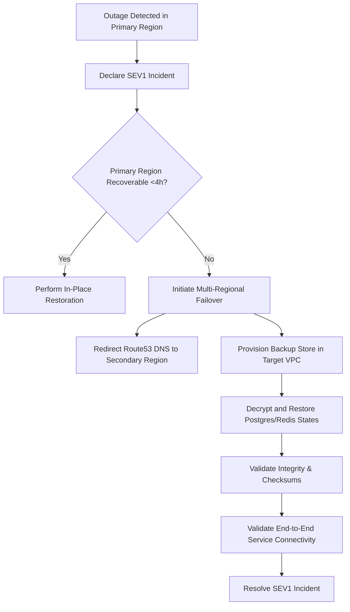

# Disaster Recovery and Regional Failover Plan
# Satisfies Requirements 32.1–32.6

This plan defines the strategy, processes, and service level agreements (SLAs) for restoring platform availability during localized or global regional outages.

---

## 1. DR Metrics & SLA Targets

- **Recovery Point Objective (RPO)**:
  - Memory, workflow states, and audit streams: **≤1 Hour**
  - Telemetry and non-critical logging: **≤24 Hours**
- **Recovery Time Objective (RTO)**:
  - System full availability restoration: **≤4 Hours**
- **Testing Frequency**:
  - Full backup-restore simulation tests performed **every 90 days**.

---

## 2. Backup Retention & Storage Isolation

1. **Storage Isolation**:
   - Backups are stored in isolated S3 buckets inside an independent DR AWS account with separate credentials.
2. **Encryption**:
   - All backups are encrypted using KMS keys managed by the independent platform Secrets Service.
3. **Retention Policies**:
   - Daily backups: Retained for 30 days.
   - Monthly backups: Retained for 365 days.

---

## 3. Failover & Restoration Steps

### Steps:
1. **Outage Identification**: Triggered when SLO monitors detect >5% API errors or database node health state failures.
2. **Halt Traffic**: Direct inbound traffic to fallback gateway showing graceful system maintenance status page.
3. **Verify Target Region**: Ensure Secondary Region VPC and compute node resources are running.
4. **Restore Backup**: Pull latest backup descriptor, perform SHA-256 integrity checks, and restore state.
5. **DNS Propagation**: Update Route53 records to point all gRPC/REST APIs to the Secondary Gateway.
6. **Audit Trail**: Emit a disaster recovery audit log detailing restore operator, duration, and metadata.
