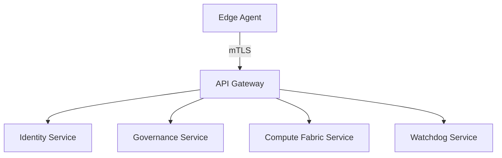

# Operational Handbooks & Platform Guide
# Satisfies Requirements 35.1–35.5

This guide consolidates platform operational documentation for Operators, Tenant Administrators, and End Users.

---

## 1. Operator Handbook (Requirement 35.1)

### Deployment Commands
To deploy the platform locally for testing:
```bash
docker compose up -d --build
```

### Monitoring & Health Probes
Internal status can be inspected by hitting the watchdog health endpoint:
```bash
curl http://localhost:50052/health
```

---

## 2. Tenant Administrator Handbook (Requirement 35.2)

### Tenant Provisioning
Tenant configurations are defined inside the governance database. Administrators can configure:
- Data Residency region.
- PII Redaction postures (`block`, `flag`, `redact`).
- Budget caps and maximum token thresholds.

### DSAR Data Erasure Requests
Under GDPR Article 17, when a user requests data erasure, execute the erasure pipeline:
```typescript
const result = await dsarService.processErasureRequest({
  tenantId: 'tenant-123',
  principalId: 'user-456',
  requestType: 'erasure',
});
```

---

## 3. End User Guide (Requirement 35.3)

### Voice Interaction & Wake Phrases
- To activate the assistant, speak the wake-phrase **"Hello May"** or click the **Push-to-Talk** hotkey in the HUD.
- The indicator will turn from **Idle** (gray) to **Listening** (blue).

### Consent & Privacy Controls
- You can revoke sensor recording consent at any time via the HUD settings panel.
- Consent revocation immediately stops recording, purges cached recording buffers, and posts a secure audit entry within 5 seconds.

### Quick Pause and Kill Switch
- **Pause (1s)**: Tap the spacebar or HUD pause button to suspend sensor captures immediately.
- **Kill Switch**: Click the red **Kill Switch** button in the tray to completely disconnect all recording systems and sign out of the session.

---

## 4. Architecture and API Reference (Requirement 35.4, 35.5)

### Platform Topology



### Core API Specifications
API specs are machine-readable and published automatically under `/docs/api/index.html`.
- **Identity API**: Token generation and validation via JSON Web Tokens.
- **Watchdog API**: Task recursion tracking and execution limits.
- **Compute Fabric API**: Scheduling inference tickets.
