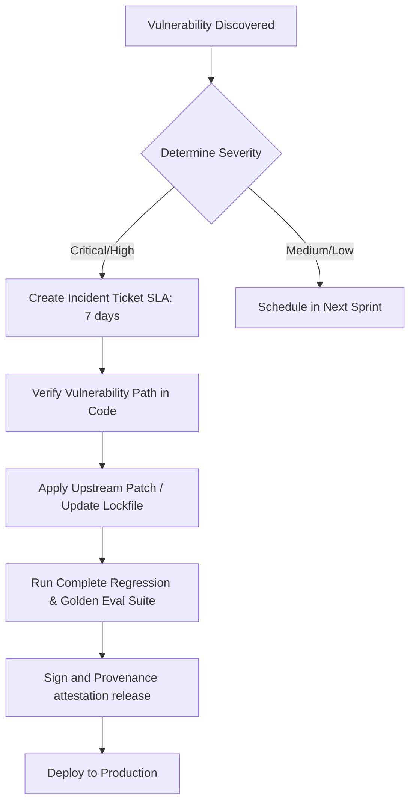

# Incident Response for Supply-Chain Vulnerability Advisories
# Satisfies Requirement 22.6

This document defines the SLA and step-by-step remediation procedures when a vulnerability is disclosed in the platform's supply-chain or external dependency trees.

---

## 1. Vulnerability Detection & SLAs
All active dependencies are scanned daily using automated workflows (Trivy, Dependabot, and npm audit).

| Severity | Target Detection-to-Mitigation SLA | Required Action |
| --- | --- | --- |
| **CRITICAL** | **7 Days** | Break-glass hotfix release |
| **HIGH** | **14 Days** | Standard sprint hotfix release |
| **MEDIUM** | **30 Days** | Next regular platform release |
| **LOW** | **90 Days / Best Effort** | Regular package dependency updates |

---

## 2. Incident Response Workflow

### Steps:
1. **Identification**: Alert dispatched immediately upon daily vulnerability scan failure or CVE advisory publish.
2. **Analysis**: Security teams trace the dependency path (e.g. `npm ls <package-name>`) to determine if the vulnerable codepath is reachable or executed.
3. **Remediation**:
   - If a direct dependency: Update `package.json` and rebuild the package-lock.json with cryptographic hashes pinned.
   - If a transitive dependency: Use `npm overrides` to force-pin the patched transitive dependency.
4. **Validation**: Run the golden eval suite and CI/CD quality gates.
5. **Release**: Re-sign release artifacts and verify SLSA provenance metadata.
